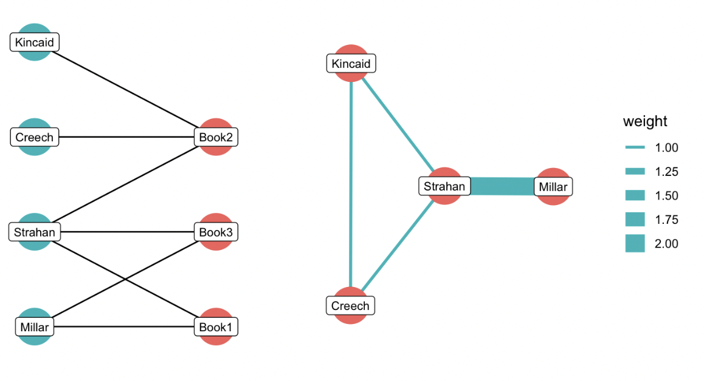
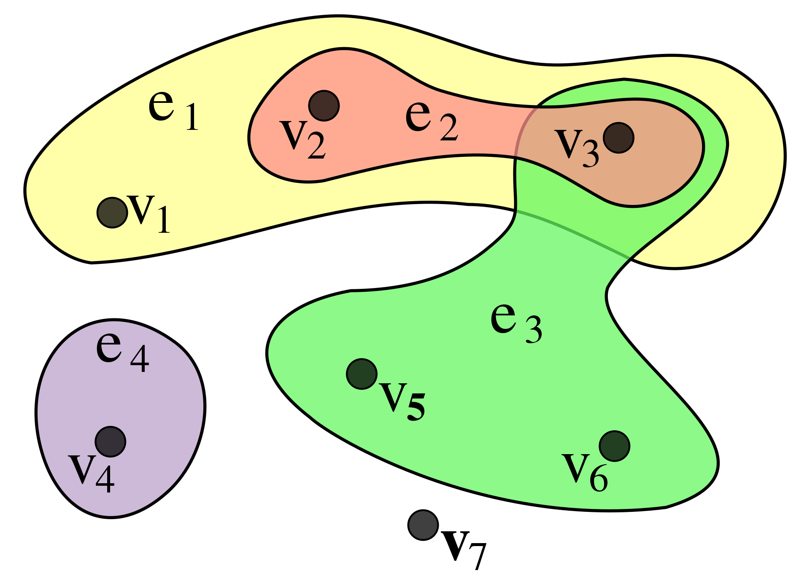
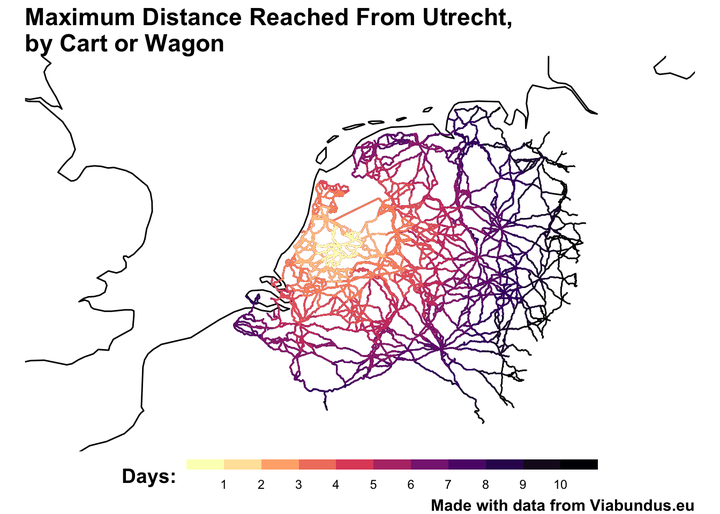

---
---
---

# Week 1, class 1: Course Introduction

[Slides for this week](https://comhis.github.io/applying-network-analysis-to-humanities/slides/1-1-introduction.html#/title-slide)

## Introduction

This course will teach you how to use networks to ask (and hopefully answer) questions relating to humanities. More specifically than this, you'll use the science of networks to model entities, and the relationships between them. To do this, you'll use your knowledge of a subject to build a *data model*: a way to conceptualise the way your data all fits together, in a way that allows you to extract network data from it.

## How to use this book and follow the course.

Each week, you will need to complete a short assignment. This takes the form of an editable R notebook, which can be found on your CSC notebooks workspace. Soon, you'll log into the CSC notebooks server, and open a *source* copy of this section, which is interactive, allowing you to edit and run code. After each week, you'll open the interactive notebook, complete the assignment, and upload the file.

As we haven't introduced R yet, for this week, your only task is to make a copy of the exercise in your personal folder, 'knit' it, and send the resulting file to the course leader. In the following weeks, this is the method you'll need to use to submit the assignments, so this is an opportunity to familiarise yourself with it, and to iron out any problems.

## What do we mean by a 'network'?

The word 'network' is ubiquitous in our daily lives. The Oxford English Dictionary tells us the term itself originally was first defined as `Work (esp. manufactured work) in which threads, wires, etc., are crossed or interlaced in the fashion of a net.` (think patch work), but now we commonly use it for any complex system of interrelated things: we all use social networking, and the telephone, railway, and road networks; an area of a city might be described as having networks of alleyways, or a historian might write about a network of trading posts.

These are all in some way metaphorical. The networks we'll learn about and use on this course have a more specific definition. In mathematics, a network is an object made up of *things* and *connections.* To use the standard language, the *things* are called **nodes** (or sometimes vertices), and the *connections* called **edges**.

These things (and connections) could be almost anything. Some typical examples include:

-   Nodes are people, and the edges their friendships or followers, as in a typical social network.

-   The nodes are books and authors, and the connection is 'written by'.

-   Nodes are web pages on the internet

<details>

<summary>In this final example, what might the connections be?</summary>

The connections between web pages are generally the hyperlinks: the system of links known as the World Wide Web.

</details>

<br>

Networks have long been used to understand aspects of historical or cultural change. In below video, accompanying a [paper in *Science*](https://www.science.org/doi/10.1126/science.1240064), researchers graphed places of birth and death---taken from Wikidata---as nodes and edges, using it as a way to trace the movement of culture from one area of the world to another, and how this changed over time.

<iframe width="560" height="315" src="https://www.youtube-nocookie.com/embed/4gIhRkCcD4U" title="YouTube video player" frameborder="0" allow="accelerometer; autoplay; clipboard-write; encrypted-media; gyroscope; picture-in-picture" allowfullscreen>

</iframe>

<br>

<details>

<summary>Given that the information is taken from Wikidata, what problems could you envisage with this study?</summary>

While Wikidata is a large data source, it is obviously very partial and has a particular focus, for example in favour of white, male, Western Europeans. The study may just replicate the biases of Wikidata itself, hiding the important cultural influences on the west, from other parts of the world.

</details>

<br>

Other typical uses of complex networks in humanities subjects include [spatial networks](https://model-articles.rrchnm.org/articles/midura/), [line of sight](https://www.frontiersin.org/articles/10.3389/fdigh.2017.00017/full) or [pottery similarity networks](https://academic.oup.com/book/40384/chapter-abstract/347130019?redirectedFrom=fulltext) in archaeology, [historic road networks](https://www.landesgeschichte.uni-goettingen.de/handelsstrassen/index.php), and [character networks in plays](http://www.martingrandjean.ch/network-visualization-shakespeare/). In this course, we'll mostly work with networks as tools for **descriptive** and **exploratory** data analysis. But network science also has wide uses in **statistical and predictive modelling**.

## Graph Theory

Representing data in this way allows us to use the mathematics of *graph theory* to find out things about it. The origins of this date back to the 18th century, and the mathematician Leonard Euler. The city of Königsberg (now Kaliningrad) was built on a river with two islands and a system (a network, perhaps?) of seven bridges connecting them. The inhabitants of the city had long wondered if there it was possible to devise a route which would cross each bridge exactly once.

Euler solved this problem by abstracting the bridge system into what we now call a graph: a structure with nodes and edges. He used this approach to prove that the path was only possible if the graph had exactly zero or two nodes with a *degree* (a count of the total connections) with an odd number.


This process: abstracting a system to its connections, and devising mathematical rules to understand it, forms the basis of modern graph theory. Graph theory has methods to perform all sorts of calculations on the network: both on the individual nodes (for example to find the most important nodes by various measurements), and on the network as a whole. Rather than think about each individual relationship separately, a network model means that we can understand some more about how each part is interrelated, how the structure itself is important, and how one node might affect another in complex ways.

## Why use networks in humanities?

Network analysis has become one of the most popular (and perhaps one of the most overused) techniques in the digital humanities toolbox. Over this course, we'll ask you to think critically about the methods you use and when they might not always be the best way to think about your data.

{width="500"}

At the same time, network analysis does have plenty to offer the digital humanist:

-   Humanities data is messy and complex, and network analysis deals well with complexity. The ubiquitous 'hairball graph', for example, might in some cases be the best way to get an overview of the structure of a large set of humanities data.

-   Human relationships are naturally interrelated. The reason two individuals might exchange correspondence is not generally random, but strongly dependent on a wider network, for example whether they have friends in common. Networks can help to untangle these dependencies.

-   Network analysis doesn't always provide the answers, but it can be a way to filter down to particularly important individuals or relationships in a dataset, worthy of a further look with your humanities hat on.

-   There are lots of other ways the tools of networks are useful, where understanding the network itself is not the end goal. For example, knowledge graphs, or certain techniques for information retrieval.

## Network Basics

This section introduces the fundamental basics of network analysis, including its key components, and various network types.

### Nodes and Edges

As already mentioned, a network is a graph consisting of nodes and edges (connections). Typically (though not always), the edges are *pairwise,* meaning they run between a pair of nodes. These are often represented visually as points (the nodes) and lines (the edges), like this:

{width="300"}

### Edge weights

These connections can often have a *weight* attached, for example the number of letters exchanged between two people, or the number of times two actors appear in a scene in a movie or play together. A weight might also be a measurement of similarity or difference between two nodes, such as a linguistic similarity between two books (a network can also be between inanimate objects!), or the distance between two cities on a map. These weights can be used in the calculations.

{width="300"}

### Edge direction

Edges can also have *directions,* meaning that the incoming and outgoing links are counted separately: for example we might count incoming and outgoing letters separately.

<br>

<details>

<summary>What might this letter count tell us about a relationship in a network? What potential danger is there is reading something from this?</summary>

It might be worth considering how the letter network was constructed. Often they are reconstructed from personal letter archives, which tend to be collections of mostly incoming letters to a single person or family. In that case, it's likely the difference between incoming and outgoing letters is not statistically significant, but simpy a product of the method of data collection.

</details>

<br>

------------------------------------------------------------------------

### Weighted and directed

These directed edges can also have separate weights attached to them:

{width="300"}

## Network paths

One of the central concepts behind networks is that they allow information to travel along the edges, moving from node to node. In a metaphorical sense, nodes with less 'hops' between them have an easier route to this information, and may be said to be close together or influential on each other. If we add more than three nodes to the network, these paths begin to emerge. A network path is simply a route, travelling along edges, from one node to another in a network. Some network metrics use these paths to estimate structural importance, for example. Paths work differently in *directed* networks: information can only move in the direction of the edges.

```{r echo=FALSE, message=FALSE, warning=FALSE, fig.cap="Network diagram showing the shortest path between node 5 and node 6. Left-hand network is undirected, meaning the path can travel along any edge. Network on the right is directed, meaning a path only exists in the direction of the edge. "}
library(tidyverse)
library(ggraph)
library(igraph)
g = tibble(a = c(1,1,2,3,4,7,6), b = c(2,3,7,5,3,4,2)) %>% graph_from_data_frame(directed = F)

s = igraph::get.shortest.paths(g, 6, 7, output = 'both')

E(g, path=unlist(s[[1]]))$color <- "red"

a = ggraph(g, 'kk') + 
  geom_edge_link(width = 2, aes(color = color)) + 
  geom_node_point(size = 20, fill = 'white', pch = 21, stroke = 2) + 
  geom_node_text(aes(label = name)) + theme_void() + 
  scale_x_continuous(expand = c(.1, .1))+ 
  scale_y_continuous(expand = c(.1, .1)) + theme(legend.position = 'none')

g = tibble(a = c(1,1,2,3,4,7,6), b = c(2,3,7,5,3,4,2)) %>% graph_from_data_frame(directed = T)

s = igraph::get.shortest.paths(g, 6, 7, output = 'both')

E(g, path=unlist(s[[1]]))$color <- "red"

b = ggraph(g, 'kk') + 
  geom_edge_link(width = 2, aes(color = color),
                 arrow = arrow(length = unit(4, 'mm')), 
                   end_cap = circle(10, 'mm')) + 
  geom_node_point(size = 20, fill = 'white', pch = 21, stroke = 2) + 
  geom_node_text(aes(label = name)) + theme_void() + 
  scale_x_continuous(expand = c(.1, .1))+ 
  scale_y_continuous(expand = c(.1, .1)) + theme(legend.position = 'none')

cowplot::plot_grid(a,b)

```

## Different Network Types

### Bipartite networks

In the above examples, the nodes and connections have been very straightforward: two things of the same *type* (people in a social network for example) connected to each other. These are known as *one-mode* or *unipartite* networks. However, many networks you'll encounter will be of things of different types. These are known as *bipartite networks,* and we'll return to them later in the course. They are very common in humanities data. Some examples include:

-   A network of characters in a play connected to scenes they appear in.

-   A network of company directors connected to companies

-   A network of publishers connected to the books they financed.

-   A network of people connected to membership of certain organisations

The diagram below is an illustration of how this looks, with a network of publishers connected to books. Each individual is listed as the publisher of a number of books, which become the two node types, connected as shown in the figure on the left. A publisher can be connected to many books, but the two types of nodes cannot be connected to each other (a publisher obviously can't publisher another publisher...).

Many network measurements and algorithms are designed to be used on regular, *one-mode* networks. Often, when working with bipartite networks, we *collapse* the network into one of the node types, meaning that we directly connect one of the types to each other, based on shared connections to the other type.

In the figure on the left below, we have collapsed the network so that now, publishers are directly connected to each other, based on shared appearances on books. If publishers shared multiple books, this can be added to the new edge as weight.

{width="500"}

<details>

<summary>What would a projected network of the other type (books connected to books) look like?</summary>

All three books would be connected to each other, because they all have one publisher in common (Strahan). Book 1 and book 3 would have an edge weight of 2, because they have two publishers in common (Millar and Strahan).

</details>

<br>

### Multigraphs

There can also be multiple *kinds* of edges, in the same network. For example in a network of historical correspondents, you might have 'met in person' as well as 'sent a letter to/from'. If these edges are not merged, these graphs are known as **multigraphs**.

```{r echo=FALSE, message=FALSE, warning=FALSE, fig.cap = "A diagram of a multigraph: a network with edges of more than one type."}
library(tidygraph)
library(igraph)
library(ggraph)
library(tidyverse)

tibble(from = c('A', 'A', 'A', 'A', 'B'),
       to = c('B', 'C', 'D', 'B', 'C'), 
       type = c('met', 'met', 'met', 'letter', 'letter')) %>% 
  graph_from_data_frame() %>% 
  ggraph() + 
  geom_edge_fan(width = 1,aes(label = type), 
                   angle_calc = 'along',
                   label_dodge = unit(2.5, 'mm'),
                   arrow = arrow(length = unit(4, 'mm')), 
                   end_cap = circle(10, 'mm')) + 
  geom_node_point(size = 20, pch = 21, fill = 'white', stroke = 2) +
  geom_node_text(aes(label = name)) + 
  theme_void() + 
  scale_x_continuous(expand = c(.2,.2)) + 
  scale_y_continuous(expand = c(.2,.2))
```

Multigraphs are also known as multi-layer networks: you could imagine each separate set of edges as a separate layer within a network. Conceptually, we might learn interesting things by understanding how the various layers overlap and interact. R and other programming languages have packages to plot and analyse them.

### Hypergraphs

The final type of network is even more exotic: in an ordinary network, an edge always connects two nodes together. A network where each edge can connect to any number of nodes is called a **hypergraph**. It's best explained with a diagram: in the figure below, an edge is no longer a line but a coloured area, and each of the points which fall within them are connected nodes. Good real-world examples are WhatsApp or Facebook groups: each person can be a member of multiple groups.

{width="500"}

<details>

<summary>What other way could we model the network of Facebook or WhatsApp groups?</summary>

These could also be considered bipartite networks (individuals connected to groups).

</details>

<br>

These networks---multigraphs and hypergraphs---require an additional set of algorithms, and generally off-the-shelf tools have not been developed for them in the same way as exist for normal graphs. However, there are packages available for R which have been developed to deal with them.

### Spatial networks

A final type of network is a spatial network: one where the nodes and edges have real-world spatial characteristics. A good example of this is a road network: edges can be represented as geometric lines, and cities and other points of interest as geographic points. These can have historical uses, for example the early modern road network of some of north-western Europe has been mapped by the Viabundus project as a spatial network: using simple network shortest-path algorithms and adding the road length as a weight, the data can be used to plot likely itineraries from one point to another.

{width="500"}

## From Bridges to Social Networks...

In the twentieth century, this graph theory began to be used by the new discipline of sociology now applied to human relationships, to understand the processes behind business, family, and friendship ties. This gave birth to the field of 'social network analysis', which over the past half a century or so has developed a whole range of theories governing the ways networks of people are formed, and what implications this has for the way they act. Human nodes naturally behave quite differently to an island, after all.

<details>

<br>

<summary>In what specific way might the connection between two people have different attributes to a connection between two islands?</summary>

Bridges and islands, clearly, don't have any choices as to whom they will connect to: it is determined by their geographic position. So many network analysis techniques may not be appropriate. But it is a good example of how graph theory should be considered firstly as a set of mathematical tools.

</details>

<br>

### The Strength of Weak Ties

We won't deal with all of these theories here, but will mention a few key ones which are good demonstrations of the way in which graph theory has been applied to social networks, and the kinds of things it has determined.. One of the pioneers of social network analysis was Mark Granovetter. In a [1973 paper](https://www.jstor.org/stable/2776392), Mark Granovetter argued that the most important ties in a network are often those which connect two separate social groups together. These ties, according to Granovatter, occupy a 'brokerage' position, and can be key in certain situations.

For example, paradoxically, job seekers are more likely to find the most useful leads through their distant acquaintances rather than their close friends...

<details>

<summary>Why might this be the case?</summary>

It's because, according to Granovetter, these distant acquaintances are more likely to be able to provide 'new' information on opportunities: a close friend, on the other hand, will probably have access to the same information as you.

</details>

<br>

This 'brokerage' position can be deduced mathematically using a metric known as *betweenness centrality* (we'll come back to that in a later class).

### It's a Small World

Another important early finding of social network analysis came from a series of experiments by the social psychologist Stanley Milgram. In 1967 Milgram devised an experiment where a series of postcards were mailed out to random people in US cities. These postcards contained basic information about a 'target' person in another, geographically-distant, city. The participants were asked to send the postcard to that person if they knew them, and if not, send it to the contact they thought might be most likely to know that person. The details of each person were recorded on the postcard at every step.

<details>

<summary>What problems can you imagine with this experiment?</summary>

It's worth considering how the experiment may be biased. Are all groups of people equally likely to answer (or have the time and money to carry out) a request from a random postcard? How might this have distorted the findings?

</details>

<br> When (or if) a postcard made it to the target person, Milgram could see how many 'hops' it had taken in order to get there. The average number of hops was between five and a half and six: this information was later used to claim that everyone in the US was connected by 'six degrees of separation'. In network terms, this is known as the 'average path length' of the network. This fact is known as the 'small world' effect.

It is also connected to the 'strength of weak ties' theory by Granovetter. This surprisingly-small number is possible because of the structure of social networks: if you want to reach someone in a distant city, are you more likely to have success if you send it to a close neighbour, or a distant acquaintance who lives there?

## The 'New' Science of Networks

The most common use of networks in academic research much of the 20th century was looking at these small, sociological networks of relationships between people. This changed in the late 1990s, when a group of scientists began to use network research to understand the structures governing many kinds of complex systems, initially using the approach to map out the structure of the World Wide Web. This research showed that many of these complex networks had a similar structure: a small number of nodes with a very large number of connections, known as *hubs,* and a large number of nodes with very few connections. In fact, they argued, the structure followed what is known as a *power-law*: essentially many nodes have a very small number of connections, an exponentially smaller number of nodes have an exponentially larger number of connections, and so forth until a tiny of number of nodes have very many connections.

These researchers, notably Albert Barabasi, argued that this process was guided by *preferential attachment*, meaning that these networks were created because nodes in a network were much more likely to attach themselves to nodes which already had many connections, leading to a 'rich get richer' effect. Perhaps most importantly, they demonstrated empirically that this particular structure could be found across a range of networks, from computers, to people, to biological networks or the structure of neurons in the brain. And they have wide-ranging implications: a scale-free network means it is easy for a disease to spread, because once it reaches a hub node it can easily move throughout the network.

These ideas, published at a time when the internet (and later social networking) moved into the mainstream, drove a huge interest in thinking about the world in a 'networked' way. They spawned a range of popular science and psychology books. Barabasi wrote [*Linked*](https://en.wikipedia.org/wiki/Linked:_The_New_Science_of_Networks)*,* one of the defining popular science books of the 2000s, and used networks to argue that this scale-free network structure could be used to explain a whole range of human behaviours, from epidemics, to economics, to politics.

## Conclusion

This outline has hopefully got you thinking about this network approach to data. A word of warning: almost everything can be represented as some kind of network. However, many of the findings from them require some careful thought: do they tell us something interesting, such as why a group of contacts formed in a particular formed in this way, or do they just reflect the data that we have collected or have available? What does a complex 'hairball' network diagram really tell us? Have the claims of *Linked* really helped us to understand business, economics, and the spread of disease?

Between now and the next class, try to consider the ways some of the data you have used in your studies might be thought of as a network, and what benefits (and pitfalls) that approach might bring.

Lastly, remember that a network is a *model:* a set of proposals to explain something about the real world. It is an artificial contruction, or a metaphor, rather than the thing itself. As such, even a very 'accurate' network is likely to be only one of many such models which could be used as an explanation for a particular phenomenon or observation. Throughout this course, you should use your critical tools to keep this in mind, and assess the usefulness of a particular model to your data explorations.
