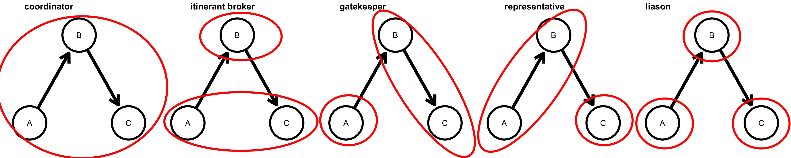
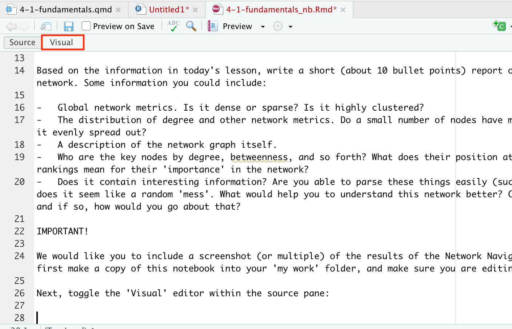

# Week 4, Class 1: Network Concepts and Metrics

## Exercises

This lesson has a corresponding editable notebook containing some exercises. These are stored as a separate notebook in the CSC notebook workspace, with the name `4-1-fundamentals_nb.Rmd`. You'll need to move a copy to your 'my-work' folder in your CSC notebook Workspace, complete the exercises, and knit them, using the [method we learned in the first class](https://comhis.github.io/applying-network-analysis-to-humanities/notebooks/1-1-introduction_nb.html). Once this is done, send a copy of the HTML file to the course leaders.

## Introduction

This lesson will cover a number of concepts. First, it outlines the concept and theory behind a number of key network metrics. These are generally divided into node-level and global metrics. Many node-level metrics are interested in *centrality*, that is, working out the most important and most influential nodes in a network. In a social network, this may point to individuals with a particular influence or role in the network, but it can also have other uses: Google's PageRank algorithm uses a version of centrality to work out which web pages are likely of the highest quality or usefulness for a particular search, for example.

Second, we'll talk briefly about some theories specific to *social network analysis* (or SNA). Social networks (that is, networks of people, where the connections and structure is governed by social factors) have their own set of concepts, which do not apply to all networks. We won't go into detail (that could be a whole other course), but it's useful to understand.

## Node-level metrics

### Degree

The degree of a node is a count of its connections. Degree can be weighted and directed. In a directed network, the separate degree counts are called in-degree and out-degree. The total degree is the sum of the two.

In this graph, the ego is connected to each alter by an incoming and outgoing link. Weights can be added to the links: degree is a sum of the weights of the links, in that case. The edge weights are labelled in the diagram below, and the numbers inside each node give the in and out degree measurements.


Depending on the network, these in and out-degree measurements may signify different types of nodes. For example, imagine a network of Twitter accounts: each follower is counted as an *incoming* link, and each person you follow is counted as an *outgoing* link, for the purposes of your degree score. If you have a high *in-degree*, you might have a high influence in this network, because you can broadcast ideas or whatever to a large number of followers. Having only a high *out-degree* in this network, on the other hand, may not make you very influential at all, because it means you follow many accounts but few follow you back.

Degree is the most common measurement of network *centrality,* or importance. A node with a high degree is likely to have more influence in the network, to have more paths pass through it, and so forth.. However, it doesn't always point to the most 'important' nodes.

First, degree measures *quantity* over *quality* of links. The node with the highest absolute number of links will always be ranked highest, no matter which nodes those links point to.

#### Degree distribution

Degree is used to measure structural properties of the network. We can do this using the **degree distribution**. A distribution counts how many nodes have a degree of 1, a degree of two, three, and so forth, or sometimes a range, such as a degree of between 1 and 5, 6 and 10, and so on. As mentioned in a previous chapter, this degree distribution tells us some valuable structural properties about the network, such as the extent to which it is a collection of hubs and less important nodes (known as 'scale-free').

To illustrate the degree distribution, below is a histogram of the degree distribution for a randomly-created scale-free network with 1000 nodes and 1000 edges. It shows that 0 to 10 nodes have a degree score of 50, 11 - 20 have a degree score of 4, and at the other end, more than 400 nodes have a degree score of just 1.

```{r echo=FALSE, message=FALSE, warning=FALSE}
library(igraph)
library(ggraph)
library(tidygraph)

igraph::sample_fitness_pl(1000, 1000, exponent.out = 2) %>% 
  igraph::degree(mode = 'total') %>% 
  as_tibble() %>% 
  count(value) %>% 
  ggplot() + 
  geom_histogram(aes(n), binwidth = 10) + 
  labs(x = 'Number of nodes', y = 'Degree score')

```

Another way to illustrate this is with a log-log plot. A log-log plot shows the same data, except the scales are logarithmic, making them easier to read.

```{r echo=FALSE, message=FALSE, warning=FALSE}

igraph::sample_fitness_pl(1000, 1000, exponent.out = 2) %>% 
  igraph::degree(mode = 'total') %>% 
  as_tibble() %>% 
  count(value) %>% 
  ggplot() + 
  geom_point(aes(value, n)) + 
  labs(x = 'Number of nodes', y = 'Degree score') + scale_x_log10() + scale_y_log10()

```

Networks with distributions which look like this on a histogram or log-log plot are likely to be scale-free, meaning their structure consists of a number of important hubs with high degree, followed by a larger number of less-important nodes.

Network science has shown that these network types are very common in all sorts of real-world situations, from biological, to social, to computer networks. They've also been shown to have a number of particular properties: for example, it may make a computer network resistant to random 'attack', because its only when hubs are removed that the network begins to become disconnected. Removing unimportant nodes doesn't affect the overall system. At the same time, this can make them vulnerable, if hub nodes are specifically targeted.

### Betweenness Centrality

Betweenness centrality measures all the paths between every pair of nodes in a network. A node has a high betweenness centrality if it is used as a 'hop' between many of these paths. In the below diagram, A has a higher betweenness centrality than B, because it is needed to traverse from the left to the right side of the network.


Betweenness centrality for a given node *v* is calculated by measuring the shortest path between every pair of nodes, and then counting the total number of these paths which pass through *v.* It can be directed, meaning that paths are only considered if they exist in the correct direction.

As mentioned above, degree is not always the best way to measure the importance of a node. It can also be important to consider the node's particular position, and the role it occupies within a larger system. In the above diagram, node A is the only way through which any of the nodes on the left can reach any on the right.

In a social network, nodes with high betweenness are often thought of as important 'brokers', as we talked about in a previous lesson. However in practice, note that high degree nodes are often the ones which have the highest betweenness values too, and there are often multiple paths between the same pair of nodes, which can limit the use of this metric.

### Eigenvector Centrality

A node that has a high eigenvector score is one that is adjacent to nodes that are themselves high scorers. Google's original PageRank algorithm used a version of this concept: ranking web pages higher in search results if they themselves were linked to by other high-scoring pages. In the example network above, both A and B have two incoming connections each, but A has a higher eigenvector centrality score because it is connected to more well-connected nodes.


### Closeness centrality

Closeness centrality measures each node's path to every other node in the network: a node is declared more central if its paths to other nodes tend to be short by this measurement (the formula is 1 divided by the average of all the shortest paths from a given node to all other nodes). Closeness centrality might be thought of as a way of measuring how quickly something flowing through the network will arrive. In the diagram below, A has a higher closeness centrality than B, even though both have the same number of connections, because A is 'less far' to all other nodes, on average.


## Edge-level metrics

## Global Metrics

### Density

The density of a network is defined as the fraction of edges which are present out of the total possible number of connections. Consider the undirected network below (a), which has four edges in total. The 'full graph' (when every node is connected to every other) of an undirected network with four nodes has six edges (b). The density of (a) therefore is 4/6, or .6666... In practice, most real-world networks are much less dense.


<br>

<details>

<summary>What implication does this have on the 'small world' networks we talked about in an earlier class?</summary>

The 'small world' effect works in low-density networks precisely because of the existence of hubs and weak ties. If there are very few ties in a network altogether, but there are a number of very well-connected hubs, then most nodes will be able to reach any other node by going through these hubs.

</details>

<br>

In a directed network, the possible number of nodes in the full graph is doubled.

On its own, density may not tell us much about the structure of a graph. Two graphs with 20 edges and 10 nodes may look very different: in one, each node may have two connections, and in another, 9 nodes may have one connection each, and the final one 10 connections. However, in combination with some other metrics, most importantly degree distribution, it may be a clue as to the underlying structure of the network.

### Average path length

The average path length is the average distance in 'hops' from one node to another in the network. In the Milgram experiments, the average path length through the network was found to be between 5 and 6. This measurement, therefore, can tell us how long it may take on average for information to get from one side of a network to another. A network with a small average path length is said to be a 'small world'.

<br>

<details>

<summary>Consider a letter network with an average path length of 4. Does this mean that information needs to go through on average 2 further people (because the start and end nodes are counted in the path) to get from A to B?</summary>

Well, not necessarily. This is a good example of why we should consider each network and set of connections carefully before using these metrics. Common sense tells us that in reality, if person A really wanted to communicate with B, there may have been no reason why they couldn't send a letter directly, without using the 'shortest path' through the other two nodes.

</details>

<br>

### Clustering coefficient

The clustering coefficient is also known as transitivity, and it is defined as the ratio of completed triangles and connected triples in the graph. The more completed triangles a network contains compared to the overall triples, the more clustered it is said to be.

Clustering is a complex topic which forms a large part of the field of Social Network Analysis. On a local level, transitivity means the probability node B will be connected to node C, *if both nodes are connected to a common neighbour, A.* The higher this probability, the more the graph is said to display clustering tendencies: if you are more likely to connect to your common neighbours, it follows that it is more likely that the graph will be divided into dense cliques and sub-groups, rather than a free-for-all where everyone is connected to everyone else.

### Groups and Community Structure in Networks

### Components

### Cliques

Networks and communities are often thought of as analogous, but in network analysis, the latter are considered a subset of the former. Discovering discrete communities---often called sub-graphs---within a wider network has long been one of the fundamental applications of network science. In epidemiological networks, for example, the extent to which a network tends to break into sub-graphs and the constitution of those parts has important implications for understanding the spread of disease through a system. While the ego networks of the previous chapters are communities in their own right,  working with a large set of merged, overlapping ego networks invites us to think about the whole, and how this whole might be redivided into clusters not necessarily corresponding to the ego networks which constitute its parts.

In a network sense, a community might be generally defined as a sub-grouping within a network which is in some way more densely connected to its internal group members than to those outside the group. The problem, of course, is that if the graph is connected (i.e. if all nodes can reach all other nodes eventually), then the boundaries of any detected community that goes beyond a simple ego network are necessarily arbitrary, flexible, and subjective. It is true that many individuals will sit firmly in the core of a given cluster, but there will be those on the margins who might be considered as members of more than one community---or none. 

In spite of these problems, this rigid way of thinking about communities can serve as a useful tool, to which we can bring our existing knowledge of historical communities and compare them to an algorithm's results. By forcing us to over-simplify, they may not be able to capture the full extent of multiple overlapping communities of identity, but they do help us to reflect on how we think of individuals operating within communities of correspondence. For example, though we might think of person X primarily as a member of group Y, if we look just at their patterns of correspondence, they seem more firmly in group Z. This is not to say that we should necessarily re-evaluate the scholarship and declare that they were in group Z all along, but it might be an indication that we should re-assess that person's patterns of correspondence---after all, belonging to a community and being more likely to correspond with its members are not the same thing. 

### Community Detection Methods

Network science has a large of algorithsm for finding optimal communities in graphs. Many rely on a metric called modularity, explained in this next section.

#### Modularity

Modularity is a score evaluating how well a given set of group labels describe the groups found in a network. It's calculated as the number of edges falling within groups minus the expected number in an equivalent network with edges placed at random ([link](https://www.pnas.org/content/103/23/8577)). In the below diagram, the modularity is high, because the groups (coloured as either red or green nodes) correctly describe the two separate 'communities' found in the network. Community detection algorithms work by trying to maximise this value.


As with the clustering coefficient, a high modularity indicates the extent to which the network might be described as a collection of densely-connected sub-groups, or whether the links are spread out evenly across the network.

```{r echo=FALSE, message=FALSE, warning=FALSE, fig.cap = 'A network with high modularity. The given partitions (separate colours) successfully divide the network into groups with many more connections between the groups than to other groups.'}

igraph::sample_islands(islands.n = 5, islands.pin = .5,islands.size = 20, n.inter = 2)  %>% as_tbl_graph() %>% 
  mutate(group = group_louvain()) %>%
  ggraph('fr') + 
  geom_edge_link(alpha = .5) + 
  geom_node_point(aes(color = as.character(group)), size = 5) +  theme_void() + theme(legend.position = 'none')

```

#### Louvain Community Detection

The Louvain algorithm is one algorithm which uses modularity, developed specifically for use in large graphs. At first, each node in the network is assigned to a community of just itself. Then, one at a time, each node is temporarily moved to the community of each of its neighbours, and the modularity of the whole graph is re-checked using the method above. Each node is kept in the community which results in the highest change in overall modularity. 

At this point, most nodes are now in a community of two (if there's no change in modularity, they stay in their own community). The next step treats these mini-communities as nodes in a network in their own right, and runs the same process again (putting each mini-community into the mini-community of its neighbour, calculating overall modularity, and moving to that which gives it the highest gain). This whole process then repeats until modularity stops increasing and communities stop merging with other communities---or a pre-supplied threshold is reached.

In very large graphs, the process is more difficult and likely to give different results depending on the random starting point. Also, while the method may be a useful way of finding communities without preconceived starting points, it does require us to think of the network as being divided into communities of some kind. Every node must be placed in a community - none can be placed outside the communities, and, perhaps more controversially, with this method, no node can be a member of more than one community. 

<center>{width="500"}</center>

Important to note is that communities are to some degree subjective, and 'densely-connected' can have different meanings depending on the algorithm. And needless to say, detecting communities on a graph alone does not make a research question!

## Social network concepts: triadic closure, transitivity, brokerage

### Triads

There are a number of different triad types, each of which, according to social theorists, tell us something about the particular role of that set of people. The proportion of various triad types in a network can tell us about its structure, and, in the case of a complex network, something of the process by which connections are formed. In this way, we connect the *micro* structure (the information on individual pairs or triads) with the *macro* (what this tells us about the overall formation and structure of a network).

In an undirected network, there are four possble triad types, as seen in the diagram below. The first, a **closed triad**, is when each node is connected to the other two. The other possibilities are **open triad**, where one of the three possible connections is not present, a **closed pair**, where just one pair of the three is connected, and a **disconnected triad**.

```{r echo=FALSE, message=FALSE,warning = FALSE, fig.cap="Four possible triad types in an undirected network", fig.align='center'}
library(tidyverse)
library(igraph)
library(ggraph)
library(tidygraph)

layout = tibble(x = c(2,3,4), y = c(1,2,1))

a =  tibble(from = c('A', 'A', 'B'), to = c('B', 'C', 'C') ) %>% 
  graph_from_data_frame(directed = F) %>%
  as_tbl_graph() %>% 
  activate(edges)  %>% 
  ggraph(layout = layout) + 
  geom_edge_link(width = 2) +  
  geom_node_point(size = 20, fill = 'white', pch = 21, stroke = 2) + 
  geom_node_text(aes(label = name)) + 
   theme_void() + 
  scale_x_continuous(expand = c(.2, .2)) + 
  scale_y_continuous(expand = c(.2, .2))

b =  tibble(from = c('A', 'A', 'B'), to = c('B', 'C', 'C') ) %>% 
  graph_from_data_frame(directed = F) %>%
  as_tbl_graph() %>% 
  activate(edges)  %>% slice(-2) %>% 
  ggraph(layout = layout) + 
  geom_edge_link(width = 2) +  
  geom_node_point(size = 20, fill = 'white', pch = 21, stroke = 2) + 
  geom_node_text(aes(label = name)) + 
   theme_void() + 
  scale_x_continuous(expand = c(.2, .2)) + 
  scale_y_continuous(expand = c(.2, .2))

c =  tibble(from = c('A', 'A', 'B'), to = c('B', 'C', 'C') ) %>% 
  graph_from_data_frame(directed = F) %>%
  as_tbl_graph() %>% 
  activate(edges)  %>% slice(-1, -3) %>% 
  ggraph(layout = layout) + 
  geom_edge_link(width = 2) +  
  geom_node_point(size = 20, fill = 'white', pch = 21, stroke = 2) + 
  geom_node_text(aes(label = name)) + 
   theme_void() + 
  scale_x_continuous(expand = c(.2, .2)) + 
  scale_y_continuous(expand = c(.2, .2))

d =  tibble(from = c('A', 'A', 'B'), to = c('B', 'C', 'C') ) %>% 
  graph_from_data_frame(directed = F) %>%
  as_tbl_graph() %>% 
  activate(edges)  %>% 
  ggraph(layout = layout) + 
  geom_edge_link(width = 2, color = 'white') +  
  geom_node_point(size = 20, fill = 'white', pch = 21, stroke = 2) + 
  geom_node_text(aes(label = name)) + 
   theme_void() + 
  scale_x_continuous(expand = c(.2, .2)) + 
  scale_y_continuous(expand = c(.2, .2))


cowplot::plot_grid(a,b,c,d, labels = c('closed triad', 'open triad', 'connected pair', 'unconnected'), label_size = 8)
```

In a directed network, the situation is more complex. Each of the connections can be incoming or outgoing, meaning there are 16 possible triad connections. Don't worry, if you want to use these, network analysis software has methods for taking a 'census' of the various triads and their counts in a particular network.

<center></center>

#### Triadic Closure

Triadic closure is the simple idea that people in a social network are more likely to connect to each other if they share another common connection. In social network theory, this is very common, and thought to drive the process of network formation. It's called triadic closure, because it measures the relation between triads - sets of three nodes. It's easy to measure in a network: we can do so simply by measuring the number of 'complete' triangles.

Why is this interesting? As well as helping to explain network formation, we can think about how various triads work on a micro-level. Let's start with a simple example: an undirected friendship network between three people. A and B know each other, as do B and C, but A and C have never met:

```{r echo=FALSE, message=FALSE, warning=FALSE, fig.height=2, fig.width=2, fig.align='center', fig.cap ="An open triad, meaning one with a missing third connection."}

b =  tibble(from = c('A', 'A', 'B'), to = c('B', 'C', 'C') ) %>% 
  graph_from_data_frame(directed = F) %>%
  as_tbl_graph() %>% 
  activate(edges)  %>% slice(-2) %>% 
  ggraph(layout = layout) + 
  geom_edge_link(width = 2) +  
  geom_node_point(size = 20, fill = 'white', pch = 21, stroke = 2) + 
  geom_node_text(aes(label = name)) + 
   theme_void() + 
  scale_x_continuous(expand = c(.2, .2)) + 
  scale_y_continuous(expand = c(.2, .2))
b
```

Mark Granovetter's paper ['The Strength of Weak Ties'](https://www.jstor.org/stable/2776392) looked at the formation of these triads their role in a network. For Granovetter, edges in a network are formed of either 'strong' or 'weak' ties. He writes that in an unclosed triad, if the two existing edges are strong ties, a third edge will always eventually appear between the final two nodes, forming a closed triad. An unclosed triad containing two strong edges is impossible and he calls this the 'forbidden triad'.

This gap, from A to C, is sometimes called a 'structural hole'. In this triad, B is particularly important because they are needed for information to be shared between A and C. B may even work to keep A and C from meeting and 'closing' the triad. The sociologist Ronald Burt, in his book *Structural Holes: The Social Structure of Competition* theorised that these gaps could be beneficial to individuals, and that people with many of these kinds of relationships were often successful in business.

Another influential paper, by Gould and Fernandez, used triads in their theory of *brokerage*. This is a process, according them, where individuals act as intermediaries in a network, helping to share information. They identify five types of brokerage roles, based on specific triad types, as seen in the image below:

<center></center>

#### A Word of Warning...

It's easy to see the appeal of these methods applied to historical or cultural sources, which we might use to uncover the specific social relations within a network of historical actors, understand the formation by which a particular correspondence network came about, or maybe measure the 'success' of a particular historical figure by the existence of 'structural holes' in their networks. I encourage you to think about and use these theories. However, do bear in mind that these theories were often developed using modern, 'complete' social network data, where every interaction was carefully recorded, often for the purposes of a particular test. As these methods rely heavily on these 'micro' structures (such as the presence or absence of a particular tie), they may be particularly sensitive to the kinds of missing data often found in historical sources, which are not usually collected systematically.

## Conclusions

This tour of network metrics has just introduced some of the more common ways a network can be measured. All of these metrics can be applied to any network, but bear in mind that many have been developed with the specific aim of measuring relations between people in some sort of set of social interactions, and the conclusions drawn are based on the consideration that the individuals are in some sense 'free agents', and can freely connect with other nodes as they wish.

In many other network types (books, or cities for example), there may be hidden factors and other constraints guiding the structure of the network. This is not to say that the metrics cannot be used, but just that the conclusions from them may not be the same as those in SNA literature.

## Class Assignment  

Before we get to coding our own networks on Friday, first we'll use some ready-made tools to generate a set of network metrics and get familiar with them.

Your task for this assignment is to load a network into an online tool called Network Navigator, available here: <https://networknavigator.jrladd.com/>, and report on its basic network statistics.

You can use any network data you like. We have prepared a sample dataset called `sample_publisher_network.csv`, available in the `applying_networks_to_humanities/data` folder, but you are welcome to use any other of the sample datasets or another dataset you have found online.

The instructions to upload the network data are available within the web application. In short, you should drag and drop the relevant .csv file into the appropriate box. Note that you can choose whether or not your csv has a header row. If it does, click the correct radio button. The application expects headers called `source`, `target`, and (optionally), `weight`. The `sample_publisher_network.csv` file has a header in this format, but if you are using other data you may need to edit the file first.

Based on the information in today's lesson, write a short (about 10 bullet points) report on the structure of this network. Some information you could include:

-   Global network metrics. Is it dense or sparse? Is it highly clustered?
-   The distribution of degree and other network metrics. Do a small number of nodes have most of the links, or is it evenly spread out?\
-   A description of the network graph itself.\
-   Who are the key nodes by degree, betweenness, and so forth? What does their position at the top of these rankings mean for their 'importance' in the network?
-   Does it contain interesting information? Are you able to parse these things easily (such as the structure), or does it seem like a random 'mess'. What would help you to understand this network better? Could it be filtered, and if so, how would you go about that?

IMPORTANT!

We would like you to include a screenshot (or multiple) of your results from the Network Navigator tool. To do this, first make a copy of this notebook into your 'my work' folder, and make sure you are editing this copy.

Take and save a screenshot and save it to your local machine. Upload it to the 'my work' folder on CSC Notebooks, using the file browser.

Next, switch to the R studio 'Visual editor' interface using the button highlighted below



The visual editor looks like a simple word processor, and has an option for inserting an image. Click this and insert the screenshot(s) you uploaded.

Once you're finished, save and send your work as usual.
