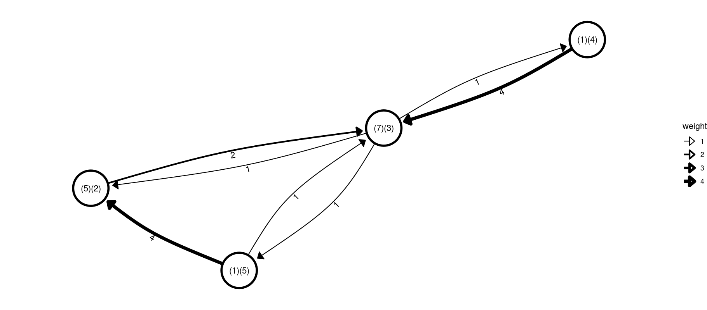
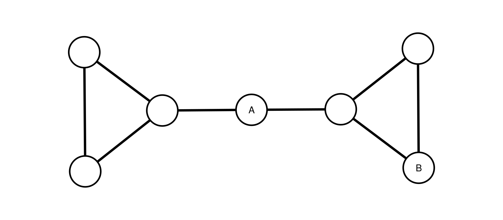
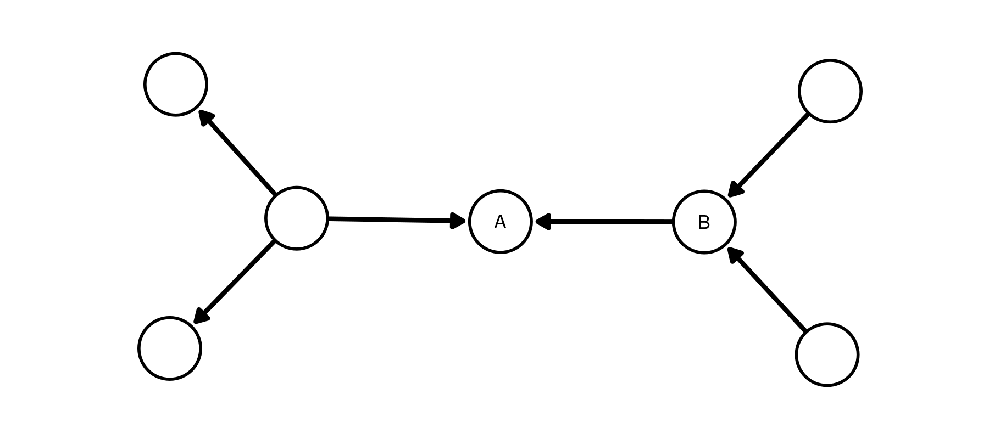
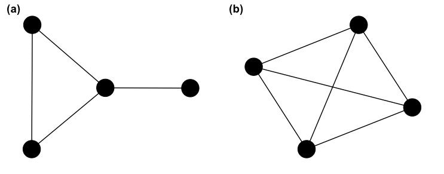
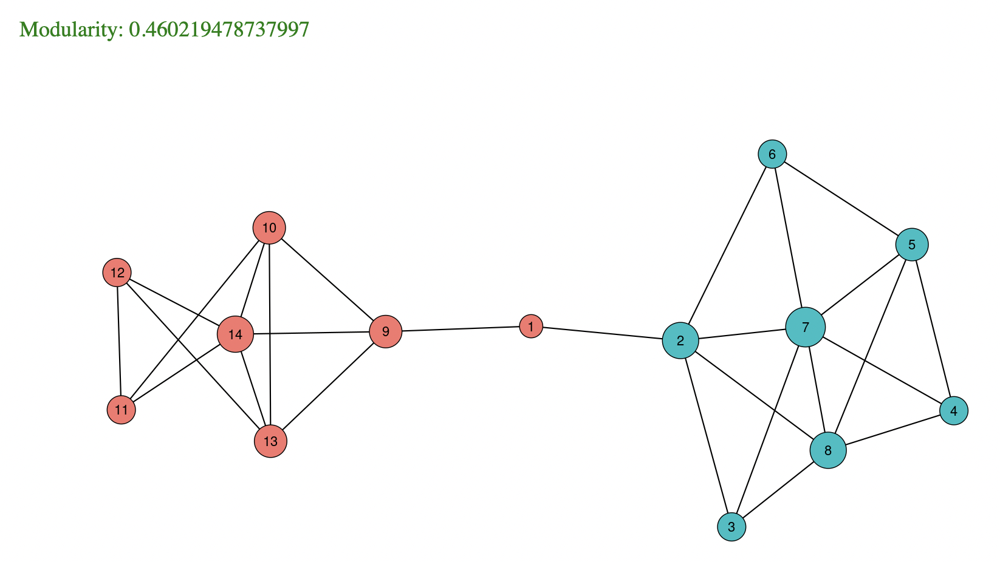

# Week 4, Class 1: Network Metrics

## Exercises

This lesson has a corresponding editable notebook containing some exercises. These are stored as a separate notebook in the CSC notebook workspace, with the name `4-1-fundamentals_nb.Rmd`. You'll need to move a copy to your 'my-work' folder in your CSC notebook Workspace, complete the exercises, and knit them, using the [method we learned in the first class](https://comhis.github.io/applying-network-analysis-to-humanities/notebooks/1-1-introduction_nb.html). Once this is done, send a copy of the HTML file to the course leaders.

## Introduction

This chapter introduces a large number of measurements by which we can understand more about a given network. These are generally divided into node-level and global metrics. Many node-level metrics are interested in *centrality*, that is, working out the most important and most influential nodes in a network. In a social network, this may point to individuals with a particular influence or role in the network, but it can also have other uses: Google's PageRank algorithm uses a version of centrality to work out which web pages are likely of the highest quality or usefulness for a particular search, for example.

## Node-level metrics

### Degree

The degree of a node is a count of its connections. Degree can be weighted and directed. In a directed network, the separate degree counts are called in-degree and out-degree. The total degree is the sum of the two.

In this graph, the ego is connected to each alter by an incoming and outgoing link. Weights can be added to the links: degree is a sum of the weights of the links, in that case. The edge weights are labelled in the diagram below, and the numbers inside each node give the in and out degree measurements.



Depending on the network, these in and out-degree measurements may signify different types of nodes. For example, imagine a network of Twitter accounts: each follower is counted as an *incoming* link, and each person you follow is counted as an *outgoing* link, for the purposes of your degree score. If you have a high *in-degree*, you might have a high influence in this network, because you can broadcast ideas or whatever to a large number of followers. Having only a high *out-degree* in this network, on the other hand, may not make you very influential at all, because it means you follow many accounts but few follow you back.

Degree is the most common measurement of network *centrality,* or importance. A node with a high degree is likely to have more influence in the network, to have more paths pass through it, and so forth.. However, it doesn't always point to the most 'important' nodes.

First, degree measures *quantity* over *quality* of links. The node with the highest absolute number of links will always be ranked highest, no matter which nodes those links point to.

#### Degree distribution

Degree is used to measure structural properties of the network. We can do this using the **degree distribution**. A distribution counts how many nodes have a degree of 1, a degree of two, three, and so forth, or sometimes a range, such as a degree of between 1 and 5, 6 and 10, and so on. As mentioned in a previous chapter, this degree distribution tells us some valuable structural properties about the network, such as the extent to which it is a collection of hubs and less important nodes (known as 'scale-free').

To illustrate the degree distribution, below is a histogram of the degree distribution for a randomly-created scale-free network with 1000 nodes and 1000 edges. It shows that 0 to 10 nodes have a degree score of 50, 11 - 20 have a degree score of 4, and at the other end, more than 400 nodes have a degree score of just 1.

```{r echo=FALSE, message=FALSE, warning=FALSE}
library(igraph)
library(ggraph)
library(tidygraph)

igraph::sample_fitness_pl(1000, 1000, exponent.out = 2) %>% 
  igraph::degree(mode = 'total') %>% 
  as_tibble() %>% 
  count(value) %>% 
  ggplot() + 
  geom_histogram(aes(n), binwidth = 10) + 
  labs(x = 'Number of nodes', y = 'Degree score')

```

Another way to illustrate this is with a log-log plot. A log-log plot shows the same data, except the scales are logarithmic, making them easier to read.

```{r echo=FALSE, message=FALSE, warning=FALSE}

igraph::sample_fitness_pl(1000, 1000, exponent.out = 2) %>% 
  igraph::degree(mode = 'total') %>% 
  as_tibble() %>% 
  count(value) %>% 
  ggplot() + 
  geom_point(aes(value, n)) + 
  labs(x = 'Number of nodes', y = 'Degree score') + scale_x_log10() + scale_y_log10()

```

Networks with distributions which look like this on a histogram or log-log plot are likely to be scale-free, meaning their structure consists of a number of important hubs with high degree, followed by a larger number of less-important nodes.

Network science has shown that these network types are very common in all sorts of real-world situations, from biological, to social, to computer networks. They've also been shown to have a number of particular properties: for example, it may make a computer network resistant to random 'attack', because its only when hubs are removed that the network begins to become disconnected. Removing unimportant nodes doesn't affect the overall system. At the same time, this can make them vulnerable, if hub nodes are specifically targeted.

### Betweenness Centrality

Betweenness centrality measures all the paths between every pair of nodes in a network. A node has a high betweenness centrality if it is used as a 'hop' between many of these paths. In the below diagram, A has a higher betweenness centrality than B, because it is needed to traverse from the left to the right side of the network.



Betweenness centrality for a given node *v* is calculated by measuring the shortest path between every pair of nodes, and then counting the total number of these paths which pass through *v.* It can be directed, meaning that paths are only considered if they exist in the correct direction.

As mentioned above, degree is not always the best way to measure the importance of a node. It can also be important to consider the node's particular position, and the role it occupies within a larger system. In the above diagram, node A is the only way through which any of the nodes on the left can reach any on the right.

In a social network, nodes with high betweenness are often thought of as important 'brokers', as we talked about in a previous lesson. However in practice, note that high degree nodes are often the ones which have the highest betweenness values too, and there are often multiple paths between the same pair of nodes, which can limit the use of this metric.

### Eigenvector Centrality

A node that has a high eigenvector score is one that is adjacent to nodes that are themselves high scorers. Google's original PageRank algorithm used a version of this concept: ranking web pages higher in search results if they themselves were linked to by other high-scoring pages. In the example network above, both A and B have two incoming connections each, but A has a higher eigenvector centrality score because it is connected to more well-connected nodes.


### Closeness centrality

Closeness centrality measures each node's path to every other node in the network: a node is declared more central if its paths to other nodes tend to be short by this measurement (the formula is 1 divided by the average of all the shortest paths from a given node to all other nodes). Closeness centrality might be thought of as a way of measuring how quickly something flowing through the network will arrive. In the diagram below, A has a higher closeness centrality than B, even though both have the same number of connections, because A is 'less far' to all other nodes, on average.



## Edge-level metrics

## Global Metrics

### Density

The density of a network is defined as the fraction of edges which are present out of the total possible number of connections. Consider the undirected network below (a), which has four edges in total. The 'full graph' (when every node is connected to every other) of an undirected network with four nodes has six edges (b). The density of (a) therefore is 4/6, or .6666... In practice, most real-world networks are much less dense.



<br>

<details>

<summary>What implication does this have on the 'small world' networks we talked about in an earlier class?</summary>

The 'small world' effect works in low-density networks precisely because of the existence of hubs and weak ties. If there are very few ties in a network altogether, but there are a number of very well-connected hubs, then most nodes will be able to reach any other node by going through these hubs.

</details>

<br>

In a directed network, the possible number of nodes in the full graph is doubled.

On its own, density may not tell us much about the structure of a graph. Two graphs with 20 edges and 10 nodes may look very different: in one, each node may have two connections, and in another, 9 nodes may have one connection each, and the final one 10 connections. However, in combination with some other metrics, most importantly degree distribution, it may be a clue as to the underlying structure of the network.

### Average path length

The average path length is the average distance in 'hops' from one node to another in the network. In the Milgram experiments, the average path length through the network was found to be between 5 and 6. This measurement, therefore, can tell us how long it may take on average for information to get from one side of a network to another.

<br>

<details>

<summary>Consider a letter network with an average path length of 4. Does this mean that information needs to go through on average 2 further people (because the start and end nodes are counted in the path) to get from A to B? </summary>

Well, not necessarily. This is a good example of why we should consider each network and set of connections carefully before using these metrics. Common sense tells us that in reality, if person A really wanted to communicate with B, there may have been no reason why they couldn't send a letter directly, without using the 'shortest path' through the other two nodes.

</details>

<br>

### Clustering coefficient

The clustering coefficient is also known as transitivity, and it is defined as the ratio of completed triangles and connected triples in the graph. The more completed triangles a network contains compared to the overall triples, the more clustered it is said to be.

Clustering is a complex topic which forms a large part of the field of Social Network Analysis. On a local level, transitivity means the probability node B will be connected to node C, *if both nodes are connected to a common neighbour, A.* The higher this probability, the more the graph is said to display clustering tendencies: if you are more likely to connect to your common neighbours, it follows that it is more likely that the graph will be divided into dense cliques and sub-groups, rather than a free-for-all where everyone is connected to everyone else.

### Modularity

Modularity is a score evaluating how well a given set of group labels describe the groups found in a network. It's calculated as the number of edges falling within groups minus the expected number in an equivalent network with edges placed at random ([link](https://www.pnas.org/content/103/23/8577)). In the below diagram, the modularity is high, because the groups (coloured as either red or green nodes) correctly describe the two separate 'communities' found in the network. Community detection algorithms work by trying to maximise this value.



As with the clustering coefficient, a high modularity indicates the extent to which the network might be described as a collection of densely-connected sub-groups, or whether the links are spread out evenly across the network.

```{r echo=FALSE, message=FALSE, warning=FALSE, fig.cap = 'A network with high modularity. The given partitions (separate colours) successfully divide the network into groups with many more connections between the groups than to other groups.'}

igraph::sample_islands(islands.n = 5, islands.pin = .5,islands.size = 20, n.inter = 2)  %>% as_tbl_graph() %>% 
  mutate(group = group_louvain()) %>%
  ggraph('fr') + 
  geom_edge_link(alpha = .5) + 
  geom_node_point(aes(color = as.character(group)), size = 5) +  theme_void() + theme(legend.position = 'none')

```

A small warning: modularity is only as useful as the groups you feed it. The Gephi modularity score, for example, first uses a community detection algorithm, and the modularity score is just the maximum that it is able to find using this method. In most cases, the found groups will not be a perfect representation of the way the network is divided.
