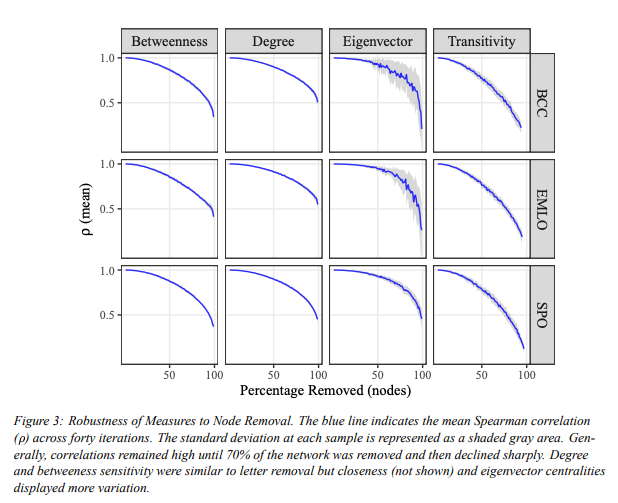
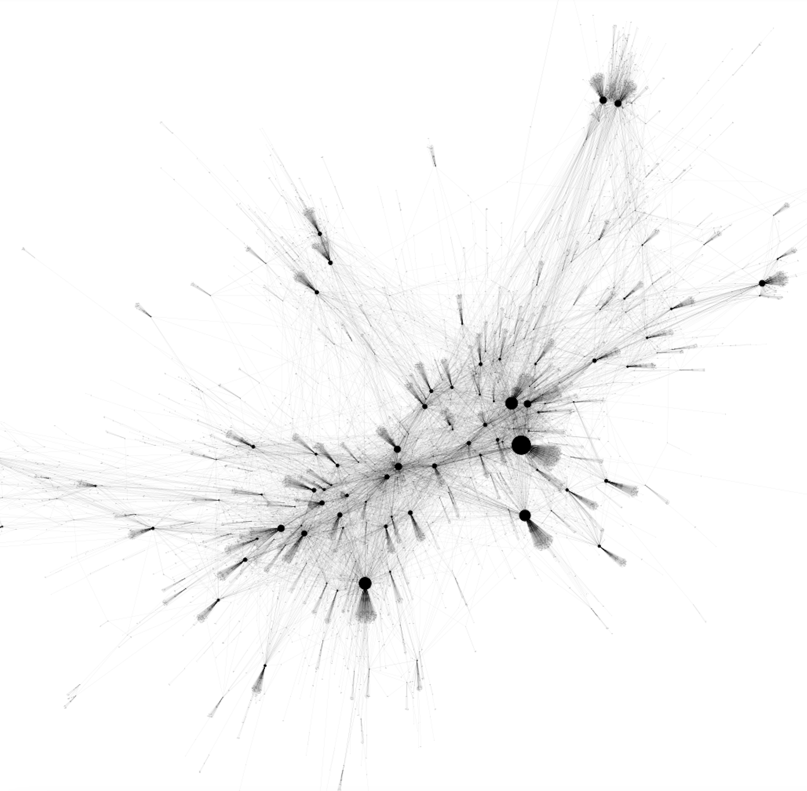
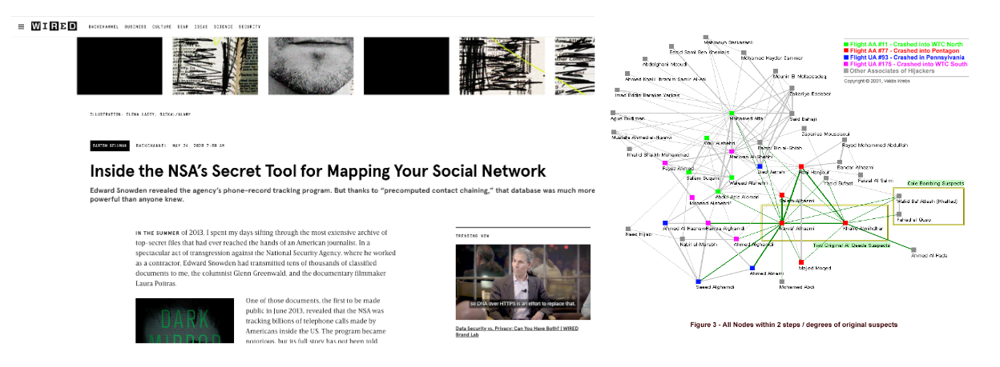
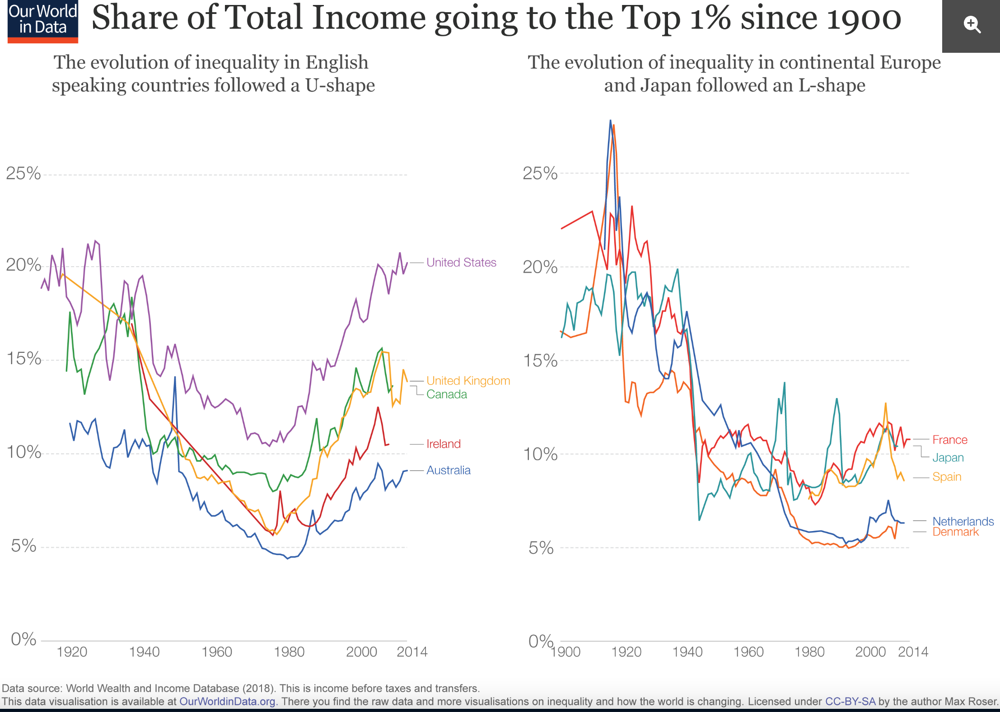
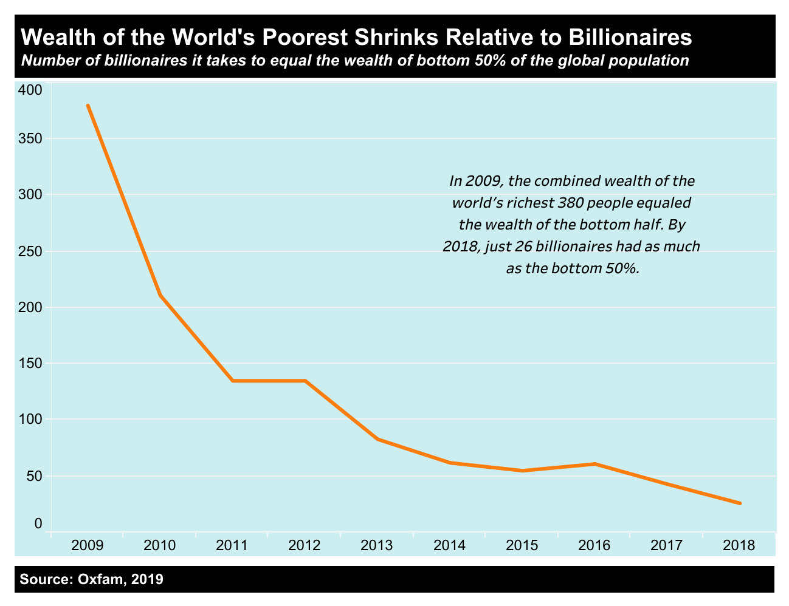
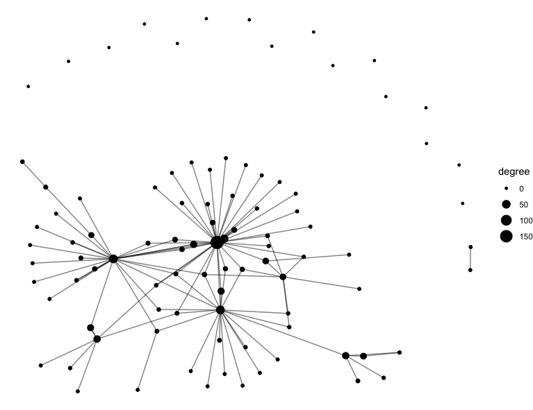
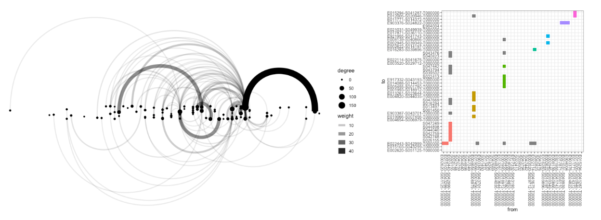

# Week 6, Class 2: Reflections and Pitfalls of Networks

Today we are going to reflect a bit on the methods we've been learning over the past few weeks. Until now, we've taken very neutral (or perhaps naive) view of networks. Each week (hopefully), you've progressively learned how to build a network from a dataset, calculate metrics, and visualise it. By now, you have what is potentially a valuable new set of methods for your digital humanist toolset, hopefully one you can apply to other work and projects in the future.

But are things so straightforward? What should we bear in mind when making, interpreting, or analysing networks? Until now, we've treated networks as helpful tools, or perhaps maps: guiding our explorations through our data, and even helping us to uncover its secrets. Today, we'll take a look at some of the ways we might be *misled* by these same maps.

## Missing data

To begin with, we'll start with one of the more obvious ways in which we might be led astray: missing data. As humanists, the data we work with is very often filled with gaps or errors. It's important to think about how this might affect the work or conclusions we come to with networks, in this case.

The key thing to think about here is to know your dataset, and the type of network. We carried out a study a number of years ago where we artificially created 'missing' gaps in a letter network, by randomly removing some of the records, and comparing the network results. Surprisingly, in that type of network, removing letter records had a pretty negligible affect, until very large numbers of letters were removed (see figure).

This was, at least in part, due to the nature of letter archives in general, and that particular set of archives. Most of the letters (and therefore connections) belonged to a small number of the nodes, because the archive was a collection of individual 'ego networks', or letter collections. The results was that if we removed letters at random, the liklihood was that it would be just one of many sent to or from these 'rich' nodes, and removing even lots of these doesn't actually affect the network much - the highly connected nodes are still connected to the highly connected nodes.

In other network types, this may not be the case. If every node was connected by just one letter to a few other nodes, then even if small numbers of letters are missing, the network might start to look drastically different.

## Networks represent data

Another common criticism we should bear in mind is that networks, naturally, are based on the data sources they come from. In many humanities cases, the data we have available is only a tiny fraction of the total available data. To give one example: below is a network from a large collection of almost half a million historical records. We wanted to use it to understand the social network and social processes of the individuals within it. At first glance, this network looks hugely complex and perhaps in some way 'complete', but of course even though this is a large collection, it is only a tiny fraction of the total letters sent by these people and their contacts: the shape of it is very much dependent on the specific collection, and the collection and archival practices which brought it all together. When we look carefully at the image, we can quite easily make out the individuals at the centre of these letter collections: they are the large nodes with lots of connections. The shape, therefore, is naturally in a large part determined by these collection practices, and perhaps not a reflection of the 'reality' of a particular social or communication network at the time.

Does this matter? Perhaps not. After all, all digital humanities work is likely to encounter the same problem, to some degree or another. However it may mean thinking about intelligent ways to use networks, and figuring out which measurements of the network are 'genuine' and which are simply artefacts of the way the data has been collected. Those with the highest degree are likely to be the ones who, for whatever reason, had their letters archived and turned into digital objects. So do they actually tell us anything that we wouldn't find out from a simple count of the letters in the archives? What extra information can the network view tell us? Conceptualising this data as a network allows us to consider lots of interesting things about it - for example, using the network to find the individuals who were important despite not being the centre of actual letter collections, or it might allow us to say something about the archive as an object itself.

## What do networks say?

We have stressed throughout the course that networks, like all models, are in some sense *metaphorical*. They are a useful fiction which we can use to represent something about our data. There is nothing inherently networked about most data. It follows that networks are a choice, and, crucially, that by using them we are making a choice as to how we think our data should be represented. Using networks is to make some kind of statement about the way you think a particular thing functions. But what is that statement?

### Networks can be ideological

Key to this is that the very model of the network can be considered as a sort of ideological statement - when we work with them, we might be asking others to imagine a particular way of viewing the world. When we work with networks---particular of the scale-free type we have often talked about throughout this course (scale-free networks are the ones which consist of a few 'hubs' and lots of lesser-connected nodes), we have a tendency to try to use them to recognise and quantify *power* and *influence.* If we accept the network model of the world, we are perhaps also implicitly accepting that the 'rich get richer' phenomenon is the primary, or perhaps only mechanism by which societies, groups, and systems work. Think about your own analysis, and those we have looked at throughout the course. Why do we focus on the most-connected nodes? What implications does that have?

The important thing is that we should understand that using networks is not just a handy way of representing reality, but it might also be a way in which we *shape* that reality, through our choices. Furthermore, even if we do decide to use networks, the details also matter. We make more implicit assumptions about the system we are looking at by the metrics we choose to prioritise, and the way in which we visualise it (more on this below).

What is it, then, that networks actually say?

### Networks, Power, Control

Many of the techniques we have used prioritise a system which values or at least tries to quantify **power.** The kinds of things that networks tell us often have to do with power or influence. We calculate the most influential nodes (influence and power are naturally closely linked), the most 'central' nodes. These nodes in the network are the ones which are able to spread information, they may act as 'gatekeepers' or 'bridges' and so forth.

Implied by this way of looking at the world is that networks and their use can also be about control. If we believe the ideas that networks can be used, for example, to view and disrupt the flow of information through a system, networks can be seen as a tool of control, when used in the 'right' way.

By using networks, and asking these kinds of questions, we may be making implicit assumptions about the kinds of things which are valued within a particular system.

### Surveillance

Another way in which networks shape our view of the world is in their role in surveillance. A famous study of terrorist networks predicted, using the network principles of triadic closure, some of the previously unknown connections amongst the terrorist cells of 9/11, and it has even been suggested that had these techniques been used before hand, they may have been able to foil the plots. Whether or not this is true, it's clear that networks can be a valuable tool to those in power. And, as we found out after the revelations of Edward Snowden, authorities were using metadata and networks to do surveillance on a large scale. Again, we should think about how our use of networks promotes or at least sustains this kind of thinking, and the implications for that. As humanities students, we rarely have to think about the implications of our work on national security, but it was something that Ahnert and Ahnert did in their study of 16th century spies, for example.

### Rich get richer?

Another implicit assumption we have made throughout this course is that there is something inevitable about the 'rich get richer' effect. This is what Barabasi showed was behind much of the formation of many real-world networks. It's known as 'preferential attachment': the phenomenon that nodes in a network will tend to connect to nodes which are already well-connected. The result is that a small number of nodes are exponentially more highly connected than most of the rest of the nodes. It's often called the 'network effect', and its seen in lots of places. In lots of areas, we see this pattern: for example book sales - the majority of books sell very few copies, and then a very small number sell millions of copies. Once a book becomes slightly popular, then it gets more publicity and better placement in book stores and online shopping site, which means even more people buy it, and so forth. Perhaps more worryingly is the extent to which the 'network effect' has concentrated wealth in the hands of a tiny number of individuals - something which has gotten worse since the middle of the 20th century in many countries (or at least not gotten better), as the figures below show.

When we consider networks within the same mechanism, we may then be in fact promoting this view. And while it may be true in some cases, it's not the only way to model the way the world works.

## Visualisations

> "There is a tendency when using graphs to become smitten with one's own data. Even though a graph of a few hundred nodes quickly becomes unreadable, it is often satisfying for the creator because the resulting figure is elegant and complex and may be subjectively beautiful, and the notion that the creator's data is"complex" fits just fine with the creator's own interpretation of it. Graphs have a tendency of making a data set look sophisticated and important, without having solved the problem of enlightening the viewer." ---Ben Fry, *Visualizing Data: Exploring and Explaining Data with the Processing Environment* (Sebastopol, CA: O'Reilly Media, 2007)

Do you agree with this statement? Another viewpoint is here: <https://gephi.wordpress.com/2011/10/12/everything-looks-like-a-graph-but-almost-nothing-should-ever-be-drawn-as-one/>

In the quote above Fry draws our attention to some of the problems with networks. The creators of Gephi, a popular graph drawing software, took an opposite view and argue that network visualisations are powerful tools when used correctly. We have also seen that from our reading last week, which looked at 'visual network analysis. Just as data is not inherently 'a network' but rather a choice we make when we represent it as so, there is also nothing inherently spatial about that network. Visualisations, too, are a choice, and they make quite strong statements about what and who is prioritised within data.

To take an example, here is a network diagram which we have used as an example during the course:

We've gotten used to looking at this type of points and line diagram, specifically this 'force-directed' one. But what is it saying? We might say that it tells us to prioritise a particular type of node - one which is highly connected. Our eyes are immediately drawn to these nodes at the centre, which are also bigger than the rest (sized by degree). We can also see that the least-connected nodes are almost inconsequential, disconnected islands at the periphery of the graph. We tend to think that this is the only way the data is presented - that there is something inevitable about thinking of centres and peripheries in this way.

However, there are plenty of other ways we could represent this data. Two possibilities are below. In the first, I have arranged the nodes from left to right in order of their dates of birth. Here, rather than prioritise centres and peripheries, we highlight the temporal nature of the data: The size and weight of the edges still says something about the 'most connected' nodes, but their position in the network no longer has that same ideological weight - it has been replaced by something else. The second is an **adjacency matrix**. An adjacency matrix makes no claims about spatial arrangements. In this case, we have arranged the nodes so that those in the same groups are listed next to each other. In this way, rather than highlight centres of power, we highlight the clusters and sub groups within the network. There is no immediate hierarchy in the positioning of the nodes.

The point is that visuailsations entail a choice. We could also take an opposite approach, and use a 'tree' diagram', which would very much embody the hierarchical nature of the data (even if it wasn't inherently so).

## Conclusions

As humanities students, we often want to understand the subtexts of anything. Thinking in a humanities way about networks, means thinking about the inherent implications of representing data in a particular way, and how we in some ways construct a reality by deciding to use networks.
