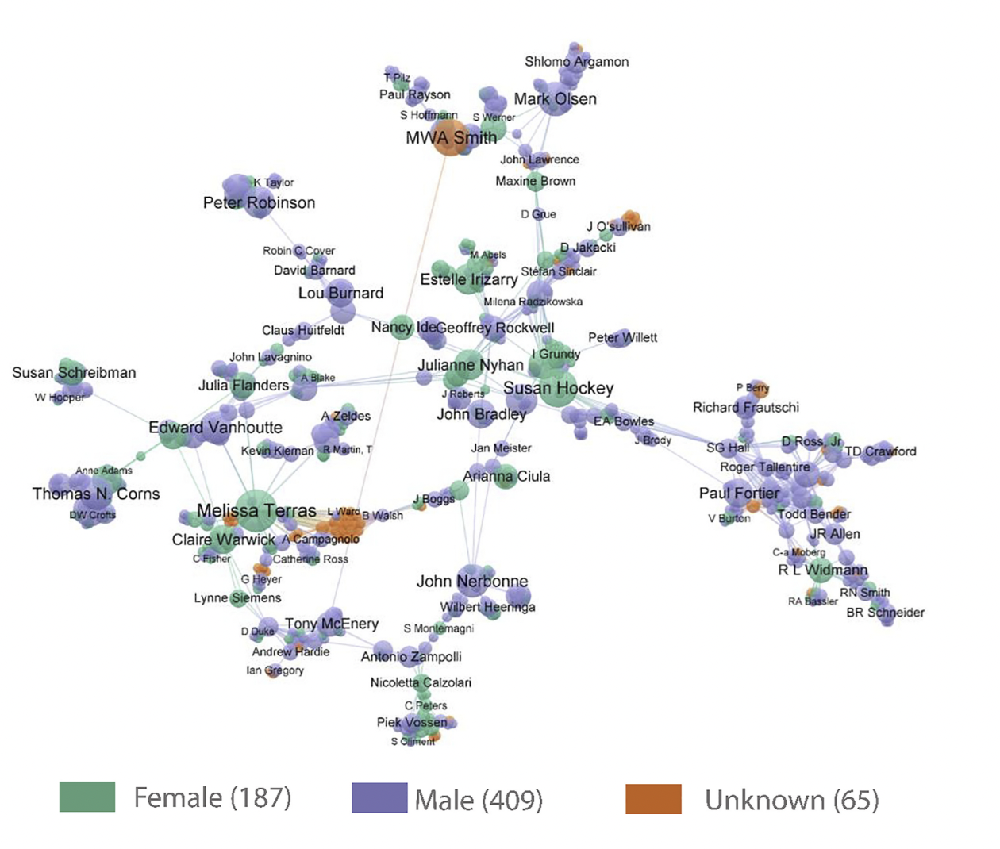

# Appendix and extra materials 

Useful as examples for the final project - things we didn't have time to cover in class. 


## Ego Networks

Very often when applying network analysis to humanities datasets, you'll be working with *ego networks*. An ego network is a network seen from the perspective of a focal node, known as the ego, and all the nodes to which it is connected, known as *alters*. In a true ego network, the network will include all the links *between* the alters.

```{r echo=FALSE, message=FALSE, warning=FALSE, fig.cap = "Example ego network", fig.height=3, fig.width=3, fig.align='center'}
library(igraph)
library(ggraph)
library(tidygraph)
tibble(to = c("A", 'A', 'A', 'A', 'C'), from = c('B', 'C', 'D', 'E', 'B')) %>% 
  graph_from_data_frame() %>% 
  ggraph('star') + 
  geom_edge_link(width = 2) + geom_node_point(size = 20, pch = 21, fill = 'white', stroke = 2) + 
  scale_x_continuous(expand = c(.1, .1))+ 
  scale_y_continuous(expand = c(.1, .1)) +
  annotate("text", x = -.5, y = .5, label = "Ego node")  +
  annotate("curve", curvature = -.2, x = -.5, xend = 0, y = .4, yend = 0,
           arrow = arrow(length=unit(0.30,"cm"), ends="last", type = "closed")) +
  annotate("text", x = -.3, y = -.7, label = "Alter")  +
  annotate("curve", curvature = -.2, x = -.2, xend = 0, y = -.75, yend = -1,
           arrow = arrow(length=unit(0.30,"cm"), ends="last", type = "closed"))  +
  annotate("text", x = .8, y = .8, label = "Alter link")  +
  annotate("curve", curvature = .2, x = .7, xend = .5, y = .75, yend = .55,
           arrow = arrow(length=unit(0.30,"cm"), ends="last", type = "closed"))+ 
  
  theme_void() 

```

These types of networks are very common in real-world networks because data is often collected from the perspective of an ego node or a number of ego nodes, for example, in a survey, or perhaps in a collection of correspondence. Because of this it is important to understand what they are, and think about whether the data is representative.

At the same time, ego network data can be very useful. Studies have shown that many metrics in an ego network correlate strongly with metrics from a full network (meaning that if an alter is central to the ego network, it is likely also central if we had the full network data too.

Network analysis from the point of view of egos can tell us about the structure of a particular node and its relationship to its neighbours. Comparing many ego networks can be used to good effect. [Lerman et al (2022)](https://www.pnas.org/doi/10.1073/pnas.2206070119) created a list of features (attributes) for the citation ego networks of authors elected to the National Academy of Sciences, successfully using those features to predict the gender of the author:

> Women's ego networks have higher average degree, edge density, and clustering coefficient. Together, these features suggest that women are more tightly embedded within their research communities. This is consistent with previous findings that women tend to gravitate to certain communities ([11](https://www.pnas.org/doi/10.1073/pnas.2206070119#core-r11)). Women have fewer peers than men, but these peers are more productive (publish more papers) and receive more citations. Finally, women NAS members have more women among their peers.

Many of the datasets you might be considering using for your final project may in fact be ego networks. It is worth thinking about the implications of this, and considering which kinds of metrics, or comparisons would work best. Is each ego network collected using the same method? If not, does this skew the results?

## Case Study: A Spotify Ego Network

This section walks through the code for creating and analysing an ego network drawn from a very different type of humanities dataset: Spotify's 'related' artists information. This is available through Spotify's API. One function of the API lets us download the twenty 'most-related' artists to a given 'seed' artist. The algorithm for how the most-related are calculated is not public, but it's likely by comparing overlapping listeners (if lots of people listen to both artist X and artist Y, those artists are marked as related).

#### Requirements

If you want to complete the (optional) exercise in the corresponding file on CSC notebooks, you'll need to sign up for a Spotify developer account. Once you've done this, create a new application using the dashboard. This will give you the necessary client ID and password. You'll then need to install the `spotifyr` package using `install.packages('spotifyr)`.

An exercise relating to the bipartite network below is another option - if for whatever reason you don't want to sign up for an account, or have difficulty accessing the API. The data for this is already available.

#### Get related artists from the Spotify API.

The `spotifyr` package makes it easy to access the Spotify API functions using R.

Once you have installed the spotifyr package, you need to tell it where to find your user ID and password. Copy these from your dashboard on the Spotify API page. Then, use the following code to temporarily store them in R's memory:

```{r}
 #Sys.setenv(SPOTIFY_CLIENT_ID = '') # uncomment these lines and add your client ID and password here, in between the quotation marks. 
 #Sys.setenv(SPOTIFY_CLIENT_SECRET = '')

```

Next, you'll use the command `get_spotify_access_token()` to use this ID and password to generate an access token.

Following this, we need to find the spotify ID for the 'ego' artist. The easiest way to do this is with the `get_artist_audio_features()` function. This can take a character string and will return the closest match, if an ID is not specified. To get the ID for the band Radiohead, we do the following:

```{r echo=TRUE, message=FALSE, warning=FALSE}

# install.packages('spotifyr') # install the package if necessary

library(spotifyr)


access_token <- get_spotify_access_token()


radiohead <- get_artist_audio_features('radiohead')

glimpse(radiohead)

```

This returns all of Radiohead's tracks along with some more information. The second column in each row is the `artist_id`, in this case `4Z8W4fKeB5YxbusRsdQVPb`, which we will use as the input for further functions.

The function to get the related artists to one artist is `get_related_artists()`. The below syntax will get Radiohead's related artists list:

```{r}
radiohead_related = spotifyr::get_related_artists('4Z8W4fKeB5YxbusRsdQVPb')

glimpse(radiohead_related)
```

The result is a dataframe with a list of the 20 closest-related artists to Radiohead, using Spotify's algorithm, with some more information including the artists' popularity and genres - and their Spotify ID. This can be visualised using the method from the previous lesson:

```{r}

library(ggraph)
library(tidygraph)
library(igraph)
radiohead_related %>% 
  mutate(ego_name = 'Radiohead') %>% 
  distinct( ego_name, name) %>% 
  as_tbl_graph() %>% 
  ggraph('stress') + geom_edge_link() + 
  geom_node_point(size = 20, fill = 'white', color = 'black', pch = 21)+ 
  geom_node_text(size = 3, aes(label =name))


```

#### 'Crawling' through the related artists information

As you might be able to tell, there is very little useful information in this type of ego network: which only includes links to and from the ego node. Each 'alter' has a degree of one, and will have the same scores for all network metrics.

However, we can use the new artists' IDs to 'crawl' through the API and get the 20 most related artists for each of them, taking a [snowball sample](https://en.wikipedia.org/wiki/Snowball_sampling) approach to creating a network. The easiest way to do this is to use a R function `lapply`, which applies a function to every element in a list, and returns a new list.

```{r}
radiohead_related_related = lapply(radiohead_related$id, get_related_artists)

radiohead_related_related = data.table::rbindlist(radiohead_related_related)

radiohead_related_related = radiohead_related_related %>% 
  mutate(seed_id = rep(radiohead_related$id, each= 20))%>% 
  mutate(ego_name = rep(radiohead_related$name, each= 20))

```

This results in dataset of the twenty related nodes plus all their own connections, which can be drawn as a network:

```{r}
g = radiohead_related_related   %>% 
  rbind(radiohead_related %>% 
  mutate(seed_id = '4Z8W4fKeB5YxbusRsdQVPb')%>% 
  mutate(ego_name = 'Radiohead') ) %>% 
  distinct(ego_name, name) %>% 
  as_tbl_graph(directed = F) %>% 
  ggraph('fr')+ geom_edge_link(alpha = .5) + 
  geom_node_point(size = 4, color = 'white') + 
  geom_node_text(size = 2, aes(label =name))
g
```

This network links all the alters to all 20 of their closest-related artists. You can see that many of the artists are not actually connected to: it is all the alters plus all their additional related artists. To simplify things, we can start with a 'true' ego network, which just includes the ego (Radiohead), the alters (the 20 related artists) and the alter links (any pairs of alters who are also related to each other).

```{r}
radiohead_related_related   %>% 
  rbind(radiohead_related %>% 
  mutate(seed_id = '4Z8W4fKeB5YxbusRsdQVPb') %>% 
  mutate(ego_name = 'Radiohead') ) %>% 
  filter(id %in% radiohead_related$id) %>% 
  distinct(ego_name, name) %>% 
  as_tbl_graph(directed = F) %>%
  mutate(group = group_louvain()) %>%
  ggraph('fr')+ geom_edge_link(alpha = .5) + 
  geom_node_point(size = 10, aes(color = as.character(group))) + 
  geom_node_text(size = 3, aes(label =name))
```

We can run community detection on the network to look for distinct clusters. Adding these alters we can see some clusters already emerging: 90s britpop (The Verve, Blur, Pulp), triphop (Portishead), Shoegaze (Slowdive, Mazzy Star), College rock/indie folk (NMH, Elliot Smith):

This ego network can tell us a number of things:

-   There are a large number of *triads*, meaning that artists are clustered together (if the Verve and Pulp are connected to Blur, it's also likely that they are connected to each other). What does a clustered network mean in this circumstance?

-   There is almost a 'clique' (a group of fully-connected nodes), including all those in green. What does a clique tell us?

-   There is one node (Smashing Pumpkins) with no other connections.

As a further step, we can crawl another level deep into the related artists' network. This will give us all the connections at a *third* level removed from Radiohead.

```{r}
level_3_related = lapply(radiohead_related_related$id, get_related_artists)

level_3_related = level_3_related %>% data.table::rbindlist() %>% 
  mutate(seed_id = rep(radiohead_related_related$id, each= 20))%>% 
  mutate(ego_name = rep(radiohead_related_related$name, each= 20))

glimpse(level_3_related)
```

```{r}

df = level_3_related %>% 
  #filter(id %in% radiohead_related_related$id)%>% 
  distinct(id, seed_id) %>% 
  as_tbl_graph(directed = F) %>% 
  mutate(total_degree = centrality_degree(mode = 'all')) %>% 
  filter(total_degree>1) %>% 
  mutate(group = group_louvain()) 


df %>% 
  ggraph('fr') + 
  geom_edge_link(alpha = .1) + 
  geom_node_point(aes(color =as.character(group)))

```

In this extended network, clusters are clearly visible again. There are too many nodes now to label them or easily divide them into genres. Instead, we'll use summarise functions to make a table of information on each of the groups.

```{r}
genres = level_3_related %>% distinct(id, genres, name)


  genres_total  = df %>% as_tibble()%>% 
  inner_join(genres, by = c('name' = 'id')) %>% 
  unnest(genres) %>% 
  count(group,genres) %>% 
    arrange(desc(n)) %>% 
    mutate(genres = paste0(genres, " (", n, ")")) %>% 
  group_by(group) %>% 
    slice_max(order_by = n, n = 20) %>% 
    summarise(genres_total = paste0(genres, collapse = ' ;'))

artist_total = df %>% as_tibble() %>% 
  inner_join(genres, by = c('name' = 'id')) %>% 
  mutate(name.y = paste0(name.y, " (", total_degree, ")")) %>% 
  arrange(desc(total_degree)) %>% 
  group_by(group) %>% slice_max(order_by = total_degree, n = 20) %>% 
  summarise(artists = paste0(name.y, collapse = ' ;'))

genres_total %>% left_join(artist_total) %>% DT::datatable()%>%
  DT::formatStyle(columns = 1:3, fontSize = '60%')
  
```

Most importantly, this shows that it's not always necessary to have access to the 'full' network in order to get results. In many cases, we will work with ego networks or sets of connected ego networks. Even so, it is possible to make interesting insights into the data regardless. The key takeaway is that you should take into account the perspective you're looking from.

#### Network metrics

Using the techniques from the previous lesson, we can make a table of network metrics:

```{r}
node_info = level_3_related %>% 
  distinct(id, name, genres) %>% rbind(level_3_related %>% select(id = seed_id,name =  ego_name, genres) %>% distinct(id, name, genres)) %>% distinct(id, name, genres) %>% select(name = id, artist_name = name, genres) %>% distinct(name, .keep_all = T)

g = level_3_related %>% 
  #filter(id %in% radiohead_related_related$id) %>% 
  distinct(id, seed_id) %>% 
  as_tbl_graph(directed = TRUE) %>% 
  left_join(node_info, by = 'name') %>% 
  mutate(in_degree = centrality_degree(mode = 'in'))%>% 
  mutate(out_degree = centrality_degree(mode = 'out'))%>% 
  mutate(total_degree = centrality_degree(mode = 'all')) %>% 
  mutate(between = centrality_betweenness()) %>% 
  arrange(desc(total_degree)) 

g %>% as_tibble() 
```

A few things to note:

The network is asymmetric: if artist A is in the top twenty of artist B, it doesn't necessarily follow that B is in the top twenty of A. We can test that by calculating the network's *reciprocity*:

```{r}
g %>% 
  filter(name %in% radiohead_related_related$id) %>% 
  igraph::reciprocity()
```

Just over 60% of links are reciprocated.

It's also transitive:

```{r}
g %>% 
  filter(name %in% radiohead_related_related$id) %>% 
  igraph::transitivity('global')

```

55% of possible triangles are complete.

The degree distribution is very particular to the sampling method. We have the 'full graph' for each of the 400 seed names (Radiohead's top twenty plus all their top twenties), but for the rest of the network (the third level removed from Radiohead), we *only* have their links to the 400 seed names. These nodes all have an incoming degree of 0, because we don't have any of their related artists, only the artists they are related to...

```{r}
g %>% igraph::degree() %>% hist(main = "Histogram of degree distribution")
```

What does this tell us about the way music is organised?

Relatedness is transitive, meaning artists tend to form triangles: if both your friends like a band, it's likely you'll like them too. Spotify can exploit this fact to make better playlist recommendations!

Relatedness is not necessarily reciprocal: there's a difference between A related to B and B related to A. Why might this be?

## Bipartite networks

The work we have done so far has been on networks which are naturally what is known as *unimodel* or *unipartite*: person A sends a letter to person B. In a letter network there is only one type of node (a letter author or recipient), and one type of node (sends/receives a letter).

Many networks are not this straightforward, and have two, or more, types of nodes. For example, a network of twitter users connected to twitter groups, or a network of directors connected to companies. These networks are known as *bimodal* or *bipartite*, if there are two types of nodes, or *tripartite* when there's three, and so forth.

The following is a diagram of a bipartite network of Facebook users and group membership.

```{r echo=FALSE, message=FALSE, warning=FALSE, fig.height=4}
library(tidygraph)
library(tidyverse)
library(igraph)
library(ggraph)

e = tibble(person = c('Alice', 'Bob', 'Carol', 'David', 'Egbert', 'Carol', 'Egbert', 'Bob'), 
       group = c('cats', 'dogs', 'rabbits', 'dogs', 'cats','dogs', 'dogs', 'cats'))

g = e %>% igraph::graph_from_data_frame()

V(g)$type <- bipartite_mapping(g)$type

g %>% ggraph::ggraph('bipartite') + 
  geom_edge_link() + 
  geom_node_point(size = 25,aes(fill = type), pch = 21) + 
  geom_node_label(aes(label = name)) +
  coord_flip() + 
  theme_void() + 
  scale_x_continuous(expand = c(.1,.1))+ 
  scale_y_reverse(expand = c(.2,.2))  + 
  theme(legend.position = 'none')

```

In this network, the first type (red, on the left) are people, and the second type (green, on the right) are Facebook groups. A line is drawn from one to the other if they are a member of that group. Carol is a member of the rabbits and dog group, Carol, David, Bob, and Egbert are members of the dog group, and Egbert and Alice members of the cat group.

In digital humanities research, we often have access to bipartite network data, because almost any two sets of data points can be represented as a bipartite network. In some cases, the dataset can be derived rather than some pre-existing membership or category the data belongs to, as, for instance, in this study of the New Zealand parliament, which constructed a bipartite network of MPs to a set of speech topics, created using LDA topic modelling. In this model MPs are the first type, and topics the second, and these are used to construct a network of MPs based on their similarity across the topics they spoke about in Parliament.

{width="400"}

It's important, therefore, to understand the extent to which regular network methods work or don't work with this structure. Standard network measurements (such as degree) are easy to calculate using these networks, but are not always meaningful. In the above example, the degree count for each node (its connections) is simply a count of its group membership. Unlike in a regular network, the measurement doesn't give any clues as to the most central member of the group. Similar problems exist for other metrics.

In many cases, then, we will need to do something to the network in order to get meaningful analysis from it. The most common thing to do is to *project* the network. This involves collapsing the network, and directly connecting one of the node types, based on their connections to the other. For example, the network above can be collapsed into two separate networks: a network of people connected by shared group membership, and a network of groups connected by shared members:

```{r echo=FALSE, message=FALSE, warning=FALSE}
b = igraph::bipartite.projection(g)

cowplot::plot_grid(b[[1]] %>% ggraph::ggraph() + 
  geom_edge_link(aes(width = weight)) + 
  geom_node_point(size = 25, pch = 21, fill = 'white') + 
  geom_node_label(aes(label = name)) +
  coord_flip() + 
  theme_void() + 
  scale_x_continuous(expand = c(.1,.1))+ 
  scale_y_reverse(expand = c(.2,.2))  + 
  theme(legend.position = 'none'), 
  b[[2]] %>% ggraph::ggraph('stress') + 
  geom_edge_link(aes(width = weight)) + 
  geom_node_point(size = 25, pch = 21, fill = 'white') + 
  geom_node_label(aes(label = name)) +
  coord_flip() + 
  theme_void() + 
  scale_x_continuous(expand = c(.1,.1))+ 
  scale_y_reverse(expand = c(.2,.2))  + 
  theme(legend.position = 'bottom'))
```

The network on the left displays a very common aspect of bipartite network projections: *cliques*, a cluster of nodes where each is connected to all the others.

In the network on the left, the edge becomes 'shares a Facebook group with', and on the right, 'has shared members'.

<details>

<summary>Which of these two networks do you think is more appropriate?</summary>

To a certain extent, that depends on the question. The more obvious answer would be to build a network of people, but if we were more interested in the 'ecosystem' of Facebook groups and how they interact, then perhaps the second network type would be of more use.

</details>

<br>

At this point, regular network metrics can be used. We might use degree, for example, to demonstrate that Alice is peripheral to this network.

However, it's important to be aware of what projecting the network does. Most importantly, there is a potential *loss of information*: in the new network, the edge only records that there is a shared group between two nodes, and the information on which groups specifically were shared is discarded.

Some of this information can be kept through a weight value attached to each node. In the diagram on the left above, Egbert and Bob have a weight of two, because they share two groups (cats and dogs). This weight information can be incorporated into your network metrics.

Technically almost any data can be modelled as a bipartite network. However, is it always appropriate?

To give a slightly ridiculous example, imagine you had a dataset of fruit, and their corresponding colours.

```{r echo=FALSE, message=FALSE, warning=FALSE}
library(tidyverse)
tibble(fruit = c('apple', 'banana', 'peach', 'pineapple', 'grape'), 
       color = c('green', 'yellow', 'pink', 'yellow', 'green')) %>% 
  kableExtra::kbl(booktabs = T) 

```

There is nothing stopping you from turning this into a bipartite network of fruit connected to colours, and even projecting this to a network of fruit directly connected by shared colours. It is very easy to technically turn this into a network.

```{r echo=FALSE, message=FALSE, warning=FALSE}
e = tibble(fruit = c('apple', 'banana', 'peach', 'pineapple', 'grape'), 
       color = c('green', 'yellow', 'pink', 'yellow', 'green'))

g = e %>% igraph::graph_from_data_frame()

V(g)$type <- bipartite_mapping(g)$type

g %>% ggraph::ggraph('bipartite') + 
  geom_edge_link() + 
  geom_node_point(size = 25, pch = 21, fill = 'white') + 
  geom_node_label(aes(label = name)) +
  coord_flip() + 
  theme_void() + 
  scale_x_continuous(expand = c(.1,.1))+ 
  scale_y_reverse(expand = c(.2,.2))  + 
  theme(legend.position = 'bottom')

```

But is it meaningful? Perhaps not, unless there was a very clear reason for doing (biologists may be interested in this very question!).

## Co-occurrence and co-authorship networks.

However, there are many cases where a bipartite network does actually make sense. Two very popular (and related) uses are **co-authorship networks** and **co-citation** **networks**. In the former, people are connected to the papers they wrote together, and in the latter, they are connected if they were cited in the same paper together.

Unlike fruit and colours, this data has some inherently networked-looking properties. The connections are likely to be clustered into different topics or academic communities, and if A and B both authored separate papers with C, they probably have a higher chance of also authoring a paper together.

Perhaps even more interestingly, this is a way of finding connections where we otherwise may have no data. We probably don't have any information on whether a large group of academic writers were in contact with each other (although maybe some of it can be found through Twitter data). A co-authorship network allows us to *infer* these connections through another dataset.

This is very often the case in humanities datasets, particularly historical, where we only have very limited information on who was in contact with whom, and then, only if their letters or some other record of their contact survived. However, we may have more information on the companies they worked for, the groups they were part of, or the publications they worked on.

Modelling this data as a network may allow us to understand subject boundaries, highlight influential individuals, and look, for example, at questions of gender or racial bias in patterns of authorship and citation. [This recent paper](https://doi.org/10.1108/JD-11-2021-0221) constructed a co-authorship network of digital humanities publications, and found that even through there were less women authors overall, they had important roles as bridges, linking otherwise disconnected areas. This network diagram from that paper shows the centrality of many of the green (female) authors:

{width="600"}

### A type of co-authorship: publisher networks

We can take a similar approach to the information found in historical books. While co-authorship itself in early modern publishing was rare, most books were *produced* by collaborations between sets of publishers and printers. These relationships are well suited to modelling as a network, and we could imagine they might display some of the network tendencies we've just discussed.

### The dataset

The dataset we'll be working with the a dataset of metadata from the English Short Title Catalogue (known as the ESTC). This data lists a unique ID for each publisher, printer, bookseller and author listed on the title pages of books printed between 1500 and 1800. This information comes from the **imprint** of the book: the list of authors, printers, publishers and so forth found on the title page.

```{r echo=FALSE, message=FALSE, warning=FALSE}

cowplot::ggdraw() + 
  cowplot::draw_image("images/hist_eng_milar.png", width = 0.5) + 
  cowplot::draw_image("images/millar-kincaid.png", width = 0.5, x = 0.5)

```

```{r echo=FALSE, message=FALSE, warning=FALSE,fig.cap="Bipartite network from book imprints", out.height="20%", out.width='99%'}
e = tibble(person = c('A. Millar', 'A. Millar', 'T. Cadell', 'A. Kincaid'), 
       group = c('History of England', "Essays Moral and Political", "History of England", "Essays Moral and Political"))

g = e %>% igraph::graph_from_data_frame()

V(g)$type <- bipartite_mapping(g)$type

b = igraph::bipartite.projection(g)
layout = tibble(x = c(2,3,4), y = c(1,2,1))
cowplot::plot_grid(g %>% ggraph::ggraph('bipartite') + 
  geom_edge_link() + 
  geom_node_point(size = 14,aes(), pch = 21) + 
  geom_node_label(aes(label = name)) +
  coord_flip() + 
  theme_void() + 
  scale_x_continuous(expand = c(.2,.2))+ 
  scale_y_reverse(expand = c(.3,.3))  + 
  theme(legend.position = 'none'), 
  b[[1]] %>% ggraph::ggraph(layout = layout) + 
  geom_edge_link(aes()) + 
  geom_node_point(size = 10, pch = 21, fill = 'white') + 
  geom_node_label(aes(label = name)) +
  coord_flip() + 
  theme_void() + 
  scale_x_continuous(expand = c(.1,.1))+ 
  scale_y_continuous(expand = c(.2,.2))  + 
  theme(legend.position = 'bottom'))
```

As you can see, the title page lists a few pieces of information: the book is 'printed for' A. Millar (who is the publisher), and 'sold by' Thomas Cadell, the bookseller. These pieces of information, showing a connection between Millar and Cadell, can form the basis of a bipartite network.

### Method

In this class we'll take this raw data, filter it, and turn it into a bipartite network of publishers and printers connected to books. We'll then *project* the network, and directly connect the publishers and printers, based on their shared co-occurrences on books. This network can then be visualised and analysed.

First, load the data into R:

```{r}
load(file = '../publisher_network/estc_actor_links')
load('../publisher_network/estc_core')
```

The data is organised like this: each row represents a book and a single actor linked to that book (meaning a publisher, printer, bookseller, or author). Each actor and book has a unique code. Further columns give information on the type of actor (some can have multiple, for example be the author and the publisher).

The book IDs and the actor IDs can be used as an *edge list*, and processed exactly the same as the previous lesson on regular one-mode networks. To do this, first filter to the appropriate types of actors, and then use `select()` to choose the `actor_id` and `estc_id` columns:

```{r}

edge_list = estc_actor_links %>% left_join(estc_core %>% select(estc_id, publication_year, publication_place)) %>% 
  filter(publication_year %in% 1750:1760) %>% 
  filter(publication_place == 'Edinburgh') %>%
  filter(actor_role_publisher == TRUE) %>% 
  select(estc_id, actor_id) 


```

Use the same functions as before to turn this into a network object:

```{r}
publisher_graph  = edge_list%>% as_tbl_graph()
```

The next steps are specific to bipartite networks. In order for R to 'know' that the network is bipartite, each node needs to have an associated type. We use an igraph function for this, called `bipartite_mapping()`. This assigns a TRUE or FALSE value to each node, depending on whether they are found in the first or second column of the data. This is saved as an attribute of the nodes using the following code:

```{r}
V(publisher_graph)$type <- bipartite_mapping(publisher_graph)$type
```

At this point, we can already visualise the network, setting the shape of the node to the type:

```{r}
publisher_graph %>% 
  ggraph('stress') +
  geom_edge_link(alpha = .2) + 
  geom_node_point(aes(shape = type),size =2) + 
  theme_void()
```

It already looks like a network structure, with a number of disconnected components (individuals who never collaborate, or only in a small group), with a central connected 'component', consisting of publishers who often collaborate on books together.

However, we want to know more specifically about the structure of the publisher network. To do this, we project it.

Igraph has another function for this, `bipartite_projection()`. Use this function on the network:

```{r}
proj = bipartite.projection(publisher_graph)
```

The result is a new object, a list, containing to further objects. These are the two network projections (publisher to publisher, and book to book). They can be accessed using `proj[[1]]` and `proj[[2]]`. We'll work with the second item, the publishers, but first, turn it into a tidygraph object so that we can work on it in the same way as the previous lessons.

```{r}
proj[[2]] = proj[[2]] %>% as_tbl_graph()

proj[[2]] 
```

Now we have a new network, consisting of publisher nodes, and edges. Note, also, that the edges have a weight attached, representing the number of shared books they occur on.

The rest of the steps can be copied directly from the previous lesson on networks. Access the publisher-to-publisher network using `proj[[2]]`, and using the same method for visualising using ggraph, draw a network diagram:

```{r}
proj[[2]] %>% 
  mutate(degree = centrality_degree(mode = 'all', weights = weight)) %>% 
  ggraph('fr') + 
  geom_edge_link(alpha = .1) + 
  geom_node_point()
```

Because we used a small sample of books, the network consists of a number of disconnected components. There is one large component, of publishers who work together in groups on several books, 2 small 'cliques' (groups of publishers all mentioned on one book, hence they are all connected together and not to anything else), and a large number of individual nodes with no connections (they were the only person listed on a single book), as well as a few pairs (two individuals listed together on a single book, and not to anyone else). 

Next week, we'll build a network like this to tackle interesting humanities questions. 

## Conclusions

-   A co-authorship network like this can get very dense very quickly, because there are many books, and only a limited number of individuals, so there will be many connections between them. It may be more meaningful to filter the data, for example using the edge weight column, to only consider 'stronger' relationships in the network (nodes which share several books together).

-   The network also has a large number of 'isolates': nodes which are disconnected completely from the full network. These could also be removed, for visual clarity at least. To do this, you could filter to remove nodes with a total degree of one.

-   This projected network is inherently *undirected*, because the edge 'shares a book title' doesn't have any direction associated with it.


## Exercises:

a)  Construct two spotify ego networks. Write up the clusters found in them. Compare their global network metrics. What does this tell you about the difference between them - for instance how wide or narrow their reach is?