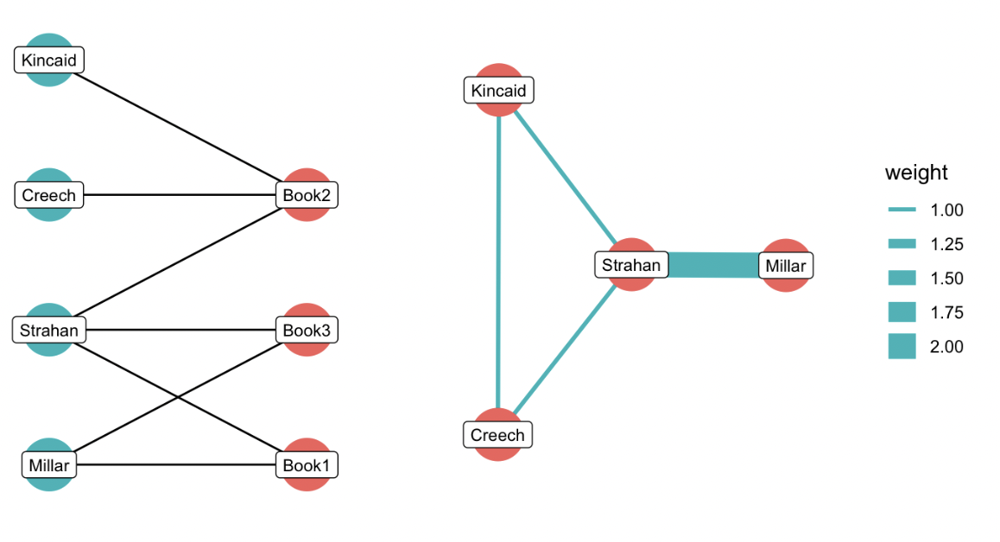
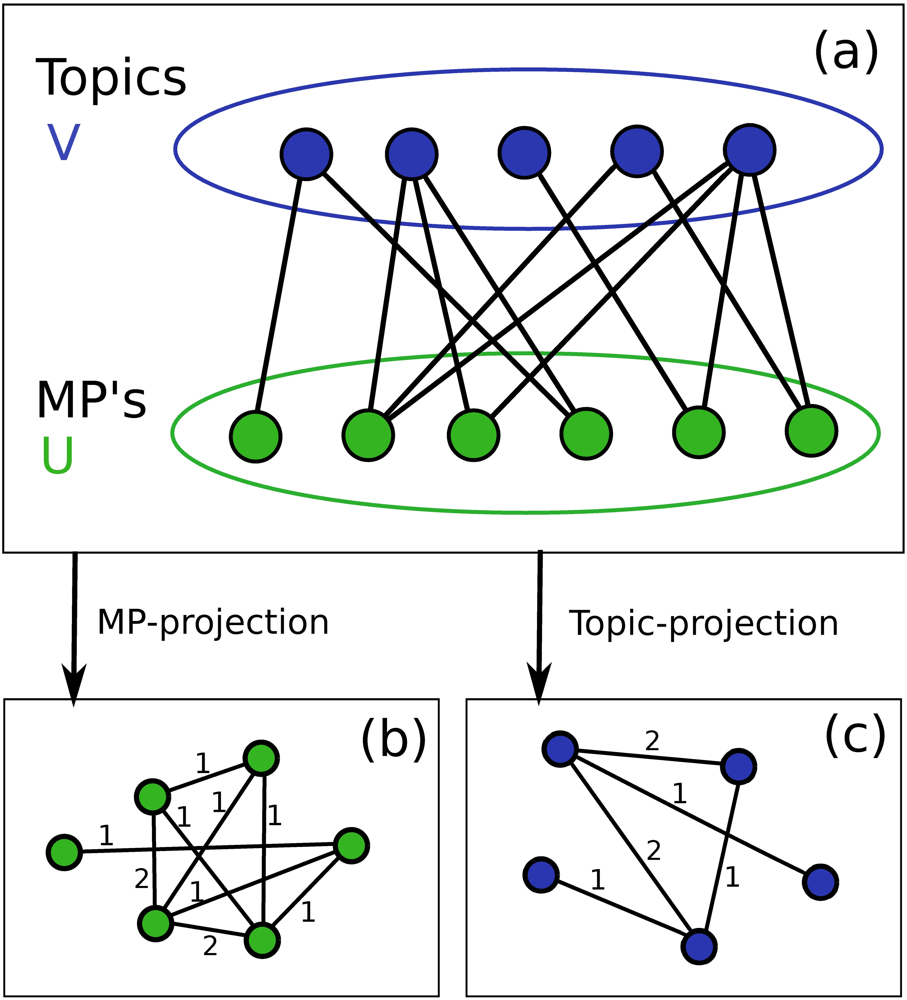

# About this Book

This book is intended to be read alongside the the "Applying Network
Analysis to Humanities' course at the University of Helsinki, beginning
November 2022.

There are two chapters for each week, one for each session. Browse
through the chapters using the menu to the left.

For most classes, there is an equivalent set of exercises. You'll
probably want to have this book at hand to complete them. They are
available as R markdown notebooks, using the CSC notebooks service.
You'll need a CSC account, and you'll be sent a join code at the
beginning of the course. If you don't have either of these things,
contact the [course leader](mailto:yann.ryan@helinki.fi).

## About the course

The course is held online, via Zoom, on Wednesdays and Fridays, between
08.15 and 09.45, starting on November 02.

Assessment is the following:

-   Completion of weekly assignments (pass/fail, carried out during
    class and finished afterwards if necessary).

-   Presentation on final project (1/5 of the grade)**, given in
    Wednesday of the final week.**

-   Final project (4/5 of the grade, s**ubmitted on December 23 at the
    latest.**

Full details on the [course page on Studies
Service](https://studies.helsinki.fi/courses/cur/hy-opt-cur-2223-7c9cdedc-fc7b-4e66-b793-1dbe0db868b7)

## Reading

Each week will have one piece of set reading, usually an article or book
chapter, to be discussed in-class the following week.

There is no set textbook, but the following are good general
introductions to networks:

**Ahnert, R., Ahnert, S., Coleman, C., & Weingart, S. (2021). *The
Network Turn: Changing Perspectives in the Humanities* (Elements in
Publishing and Book Culture). Cambridge: Cambridge University Press.
<doi:10.1017/9781108866804>**

Short, very readable volume on networks, specifically focused on
humanities applications. Free, open access copy available through the
above link.

**Easley, D., and Kleinberg,J. (2010). *Networks, Crowds, and Markets:
Reasoning about a Highly Connected World.* Cambridge University Press.**

Very comprehensive textbook on networks, mostly relating to economics,
sociology, computing. Pre-publication draft is available for free on the
[book website](https://www.cs.cornell.edu/home/kleinber/networks-book/).

**Barabási, A.-L. (2002). *Linked: The New Science of Networks*. Perseus
Pub.**

Popular science book on networks, very influential in bringing the
science of networks to a popular audience.

**Newman, M. E. J. (2018). *Networks* (Second edition). Oxford
University Press.**

Comprehensive textbook of network theory, recommended if you want to
understand algorithms etc. in more detail.

Also worth checking out is the [extensive
bibliography](https://historicalnetworkresearch.org/bibliography/) and
[journal](https://jhnr.uni.lu/index.php/jhnr) by the Historical Network
Research Community.

## Slides

There are also a set of slides for each week, which you can access here:

-   Week 1: [class
    1](https://comhis.github.io/applying-network-analysis-to-humanities/slides/1-1-introduction.html),
    [class
    2](https://comhis.github.io/applying-network-analysis-to-humanities/slides/1-2-intro-to-r.html)

-   Week 2: [class
    1](https://comhis.github.io/applying-network-analysis-to-humanities/slides/2-1-network-data.html),
    [class
    2](https://comhis.github.io/applying-network-analysis-to-humanities/slides/2-2-data-cleaning.html)

-   Week 3: [class
    1](https://comhis.github.io/applying-network-analysis-to-humanities/slides/3-1-fundamentals-data-modelling.html),
    [class
    2](https://comhis.github.io/applying-network-analysis-to-humanities/slides/3-2-building-data-model.html)

-   Week 4: [class
    1](https://comhis.github.io/applying-network-analysis-to-humanities/slides/4-1-fundamentals.html),
    [class
    2](https://comhis.github.io/applying-network-analysis-to-humanities/slides/4-2-networks-with-r.html)

-   Week 5: [class
    1](https://comhis.github.io/applying-network-analysis-to-humanities/slides/5-1-visualising-with-ggraph.html),
    [class
    2](https://comhis.github.io/applying-network-analysis-to-humanities/slides/visualising-gephi.html)

-   Week 6: [class
    1](https://comhis.github.io/applying-network-analysis-to-humanities/slides/bipartite-networks.html),
    [class
    2](https://comhis.github.io/applying-network-analysis-to-humanities/slides/6-2-literary-linguistic.html)

-   Week 7: [class
    1](https://comhis.github.io/applying-network-analysis-to-humanities/slides/7-reflections.html)

<!--chapter:end:index.Rmd-->

---
---
---

# Week 1, class 1: Course Introduction

[Slides for this week](https://comhis.github.io/applying-network-analysis-to-humanities/slides/1-1-introduction.html#/title-slide)

## Introduction

This course will teach you how to use networks to ask (and hopefully answer) questions relating to humanities. More specifically than this, you'll use the science of networks to model entities, and the relationships between them. To do this, you'll use your knowledge of a subject to build a *data model*: a way to conceptualise the way your data all fits together, in a way that allows you to extract network data from it.

## How to use this book and follow the course.

Each week, you will need to complete a short assignment. This takes the form of an editable R notebook, which can be found on your CSC notebooks workspace. Soon, you'll log into the CSC notebooks server, and open a *source* copy of this section, which is interactive, allowing you to edit and run code. After each week, you'll open the interactive notebook, complete the assignment, and upload the file.

As we haven't introduced R yet, for this week, your only task is to make a copy of the exercise in your personal folder, 'knit' it, and send the resulting file to the course leader. In the following weeks, this is the method you'll need to use to submit the assignments, so this is an opportunity to familiarise yourself with it, and to iron out any problems.

## What do we mean by a 'network'?

The word 'network' is ubiquitous in our daily lives. The Oxford English Dictionary tells us the term itself originally was first defined as `Work (esp. manufactured work) in which threads, wires, etc., are crossed or interlaced in the fashion of a net.` (think patch work), but now we commonly use it for any complex system of interrelated things: we all use social networking, and the telephone, railway, and road networks; an area of a city might be described as having networks of alleyways, or a historian might write about a network of trading posts.

These are all in some way metaphorical. The networks we'll learn about and use on this course have a more specific definition. In mathematics, a network is an object made up of *things* and *connections.* To use the standard language, the *things* are called **nodes** (or sometimes vertices), and the *connections* called **edges**.

These things (and connections) could be almost anything. Some typical examples include:

-   Nodes are people, and the edges their friendships or followers, as in a typical social network.

-   The nodes are books and authors, and the connection is 'written by'.

-   Nodes are web pages on the internet

<details>

<summary>In this final example, what might the connections be?</summary>

The connections between web pages are generally the hyperlinks: the system of links known as the World Wide Web.

</details>

<br>

Networks have long been used to understand aspects of historical or cultural change. In below video, accompanying a [paper in *Science*](https://www.science.org/doi/10.1126/science.1240064), researchers graphed places of birth and death---taken from Wikidata---as nodes and edges, using it as a way to trace the movement of culture from one area of the world to another, and how this changed over time.

<iframe width="560" height="315" src="https://www.youtube-nocookie.com/embed/4gIhRkCcD4U" title="YouTube video player" frameborder="0" allow="accelerometer; autoplay; clipboard-write; encrypted-media; gyroscope; picture-in-picture" allowfullscreen>

</iframe>

<br>

<details>

<summary>Given that the information is taken from Wikidata, what problems could you envisage with this study?</summary>

While Wikidata is a large data source, it is obviously very partial and has a particular focus, for example in favour of white, male, Western Europeans. The study may just replicate the biases of Wikidata itself, hiding the important cultural influences on the west, from other parts of the world.

</details>

<br>

Other typical uses of complex networks in humanities subjects include [spatial networks](https://model-articles.rrchnm.org/articles/midura/), [line of sight](https://www.frontiersin.org/articles/10.3389/fdigh.2017.00017/full) or [pottery similarity networks](https://academic.oup.com/book/40384/chapter-abstract/347130019?redirectedFrom=fulltext) in archaeology, [historic road networks](https://www.landesgeschichte.uni-goettingen.de/handelsstrassen/index.php), and [character networks in plays](http://www.martingrandjean.ch/network-visualization-shakespeare/). In this course, we'll mostly work with networks as tools for **descriptive** and **exploratory** data analysis. But network science also has wide uses in **statistical and predictive modelling**.

## Graph Theory

Representing data in this way allows us to use the mathematics of *graph theory* to find out things about it. The origins of this date back to the 18th century, and the mathematician Leonard Euler. The city of Königsberg (now Kaliningrad) was built on a river with two islands and a system (a network, perhaps?) of seven bridges connecting them. The inhabitants of the city had long wondered if there it was possible to devise a route which would cross each bridge exactly once.

Euler solved this problem by abstracting the bridge system into what we now call a graph: a structure with nodes and edges. He used this approach to prove that the path was only possible if the graph had exactly zero or two nodes with a *degree* (a count of the total connections) with an odd number.


This process: abstracting a system to its connections, and devising mathematical rules to understand it, forms the basis of modern graph theory. Graph theory has methods to perform all sorts of calculations on the network: both on the individual nodes (for example to find the most important nodes by various measurements), and on the network as a whole. Rather than think about each individual relationship separately, a network model means that we can understand some more about how each part is interrelated, how the structure itself is important, and how one node might affect another in complex ways.

## Why use networks in humanities?

Network analysis has become one of the most popular (and perhaps one of the most overused) techniques in the digital humanities toolbox. Over this course, we'll ask you to think critically about the methods you use and when they might not always be the best way to think about your data.

{width="500"}

At the same time, network analysis does have plenty to offer the digital humanist:

-   Humanities data is messy and complex, and network analysis deals well with complexity. The ubiquitous 'hairball graph', for example, might in some cases be the best way to get an overview of the structure of a large set of humanities data.

-   Human relationships are naturally interrelated. The reason two individuals might exchange correspondence is not generally random, but strongly dependent on a wider network, for example whether they have friends in common. Networks can help to untangle these dependencies.

-   Network analysis doesn't always provide the answers, but it can be a way to filter down to particularly important individuals or relationships in a dataset, worthy of a further look with your humanities hat on.

-   There are lots of other ways the tools of networks are useful, where understanding the network itself is not the end goal. For example, knowledge graphs, or certain techniques for information retrieval.

## Network Basics

This section introduces the fundamental basics of network analysis, including its key components, and various network types.

### Nodes and Edges

As already mentioned, a network is a graph consisting of nodes and edges (connections). Typically (though not always), the edges are *pairwise,* meaning they run between a pair of nodes. These are often represented visually as points (the nodes) and lines (the edges), like this:

{width="300"}

### Edge weights

These connections can often have a *weight* attached, for example the number of letters exchanged between two people, or the number of times two actors appear in a scene in a movie or play together. A weight might also be a measurement of similarity or difference between two nodes, such as a linguistic similarity between two books (a network can also be between inanimate objects!), or the distance between two cities on a map. These weights can be used in the calculations.

{width="300"}

### Edge direction

Edges can also have *directions,* meaning that the incoming and outgoing links are counted separately: for example we might count incoming and outgoing letters separately.

<br>

<details>

<summary>What might this letter count tell us about a relationship in a network? What potential danger is there is reading something from this?</summary>

It might be worth considering how the letter network was constructed. Often they are reconstructed from personal letter archives, which tend to be collections of mostly incoming letters to a single person or family. In that case, it's likely the difference between incoming and outgoing letters is not statistically significant, but simpy a product of the method of data collection.

</details>

<br>

------------------------------------------------------------------------

### Weighted and directed

These directed edges can also have separate weights attached to them:

{width="300"}

## Network paths

One of the central concepts behind networks is that they allow information to travel along the edges, moving from node to node. In a metaphorical sense, nodes with less 'hops' between them have an easier route to this information, and may be said to be close together or influential on each other. If we add more than three nodes to the network, these paths begin to emerge. A network path is simply a route, travelling along edges, from one node to another in a network. Some network metrics use these paths to estimate structural importance, for example. Paths work differently in *directed* networks: information can only move in the direction of the edges.

 

## Different Network Types

### Bipartite networks

In the above examples, the nodes and connections have been very straightforward: two things of the same *type* (people in a social network for example) connected to each other. These are known as *one-mode* or *unipartite* networks. However, many networks you'll encounter will be of things of different types. These are known as *bipartite networks,* and we'll return to them later in the course. They are very common in humanities data. Some examples include:

-   A network of characters in a play connected to scenes they appear in.

-   A network of company directors connected to companies

-   A network of publishers connected to the books they financed.

-   A network of people connected to membership of certain organisations

The diagram below is an illustration of how this looks, with a network of publishers connected to books. Each individual is listed as the publisher of a number of books, which become the two node types, connected as shown in the figure on the left. A publisher can be connected to many books, but the two types of nodes cannot be connected to each other (a publisher obviously can't publisher another publisher...).

Many network measurements and algorithms are designed to be used on regular, *one-mode* networks. Often, when working with bipartite networks, we *collapse* the network into one of the node types, meaning that we directly connect one of the types to each other, based on shared connections to the other type.

In the figure on the left below, we have collapsed the network so that now, publishers are directly connected to each other, based on shared appearances on books. If publishers shared multiple books, this can be added to the new edge as weight.

{width="500"}

<details>

<summary>What would a projected network of the other type (books connected to books) look like?</summary>

All three books would be connected to each other, because they all have one publisher in common (Strahan). Book 1 and book 3 would have an edge weight of 2, because they have two publishers in common (Millar and Strahan).

</details>

<br>

### Multigraphs

There can also be multiple *kinds* of edges, in the same network. For example in a network of historical correspondents, you might have 'met in person' as well as 'sent a letter to/from'. If these edges are not merged, these graphs are known as **multigraphs**.

 

Multigraphs are also known as multi-layer networks: you could imagine each separate set of edges as a separate layer within a network. Conceptually, we might learn interesting things by understanding how the various layers overlap and interact. R and other programming languages have packages to plot and analyse them.

### Hypergraphs

The final type of network is even more exotic: in an ordinary network, an edge always connects two nodes together. A network where each edge can connect to any number of nodes is called a **hypergraph**. It's best explained with a diagram: in the figure below, an edge is no longer a line but a coloured area, and each of the points which fall within them are connected nodes. Good real-world examples are WhatsApp or Facebook groups: each person can be a member of multiple groups.

{width="500"}

<details>

<summary>What other way could we model the network of Facebook or WhatsApp groups?</summary>

These could also be considered bipartite networks (individuals connected to groups).

</details>

<br>

These networks---multigraphs and hypergraphs---require an additional set of algorithms, and generally off-the-shelf tools have not been developed for them in the same way as exist for normal graphs. However, there are packages available for R which have been developed to deal with them.

### Spatial networks

A final type of network is a spatial network: one where the nodes and edges have real-world spatial characteristics. A good example of this is a road network: edges can be represented as geometric lines, and cities and other points of interest as geographic points. These can have historical uses, for example the early modern road network of some of north-western Europe has been mapped by the Viabundus project as a spatial network: using simple network shortest-path algorithms and adding the road length as a weight, the data can be used to plot likely itineraries from one point to another.

{width="500"}

## From Bridges to Social Networks...

In the twentieth century, this graph theory began to be used by the new discipline of sociology now applied to human relationships, to understand the processes behind business, family, and friendship ties. This gave birth to the field of 'social network analysis', which over the past half a century or so has developed a whole range of theories governing the ways networks of people are formed, and what implications this has for the way they act. Human nodes naturally behave quite differently to an island, after all.

<details>

<br>

<summary>In what specific way might the connection between two people have different attributes to a connection between two islands?</summary>

Bridges and islands, clearly, don't have any choices as to whom they will connect to: it is determined by their geographic position. So many network analysis techniques may not be appropriate. But it is a good example of how graph theory should be considered firstly as a set of mathematical tools.

</details>

<br>

### The Strength of Weak Ties

We won't deal with all of these theories here, but will mention a few key ones which are good demonstrations of the way in which graph theory has been applied to social networks, and the kinds of things it has determined.. One of the pioneers of social network analysis was Mark Granovetter. In a [1973 paper](https://www.jstor.org/stable/2776392), Mark Granovetter argued that the most important ties in a network are often those which connect two separate social groups together. These ties, according to Granovatter, occupy a 'brokerage' position, and can be key in certain situations.

For example, paradoxically, job seekers are more likely to find the most useful leads through their distant acquaintances rather than their close friends...

<details>

<summary>Why might this be the case?</summary>

It's because, according to Granovetter, these distant acquaintances are more likely to be able to provide 'new' information on opportunities: a close friend, on the other hand, will probably have access to the same information as you.

</details>

<br>

This 'brokerage' position can be deduced mathematically using a metric known as *betweenness centrality* (we'll come back to that in a later class).

### It's a Small World

Another important early finding of social network analysis came from a series of experiments by the social psychologist Stanley Milgram. In 1967 Milgram devised an experiment where a series of postcards were mailed out to random people in US cities. These postcards contained basic information about a 'target' person in another, geographically-distant, city. The participants were asked to send the postcard to that person if they knew them, and if not, send it to the contact they thought might be most likely to know that person. The details of each person were recorded on the postcard at every step.

<details>

<summary>What problems can you imagine with this experiment?</summary>

It's worth considering how the experiment may be biased. Are all groups of people equally likely to answer (or have the time and money to carry out) a request from a random postcard? How might this have distorted the findings?

</details>

<br> When (or if) a postcard made it to the target person, Milgram could see how many 'hops' it had taken in order to get there. The average number of hops was between five and a half and six: this information was later used to claim that everyone in the US was connected by 'six degrees of separation'. In network terms, this is known as the 'average path length' of the network. This fact is known as the 'small world' effect.

It is also connected to the 'strength of weak ties' theory by Granovetter. This surprisingly-small number is possible because of the structure of social networks: if you want to reach someone in a distant city, are you more likely to have success if you send it to a close neighbour, or a distant acquaintance who lives there?

## The 'New' Science of Networks

The most common use of networks in academic research much of the 20th century was looking at these small, sociological networks of relationships between people. This changed in the late 1990s, when a group of scientists began to use network research to understand the structures governing many kinds of complex systems, initially using the approach to map out the structure of the World Wide Web. This research showed that many of these complex networks had a similar structure: a small number of nodes with a very large number of connections, known as *hubs,* and a large number of nodes with very few connections. In fact, they argued, the structure followed what is known as a *power-law*: essentially many nodes have a very small number of connections, an exponentially smaller number of nodes have an exponentially larger number of connections, and so forth until a tiny of number of nodes have very many connections.

These researchers, notably Albert Barabasi, argued that this process was guided by *preferential attachment*, meaning that these networks were created because nodes in a network were much more likely to attach themselves to nodes which already had many connections, leading to a 'rich get richer' effect. Perhaps most importantly, they demonstrated empirically that this particular structure could be found across a range of networks, from computers, to people, to biological networks or the structure of neurons in the brain. And they have wide-ranging implications: a scale-free network means it is easy for a disease to spread, because once it reaches a hub node it can easily move throughout the network.

These ideas, published at a time when the internet (and later social networking) moved into the mainstream, drove a huge interest in thinking about the world in a 'networked' way. They spawned a range of popular science and psychology books. Barabasi wrote [*Linked*](https://en.wikipedia.org/wiki/Linked:_The_New_Science_of_Networks)*,* one of the defining popular science books of the 2000s, and used networks to argue that this scale-free network structure could be used to explain a whole range of human behaviours, from epidemics, to economics, to politics.

## Conclusion

This outline has hopefully got you thinking about this network approach to data. A word of warning: almost everything can be represented as some kind of network. However, many of the findings from them require some careful thought: do they tell us something interesting, such as why a group of contacts formed in a particular formed in this way, or do they just reflect the data that we have collected or have available? What does a complex 'hairball' network diagram really tell us? Have the claims of *Linked* really helped us to understand business, economics, and the spread of disease?

Between now and the next class, try to consider the ways some of the data you have used in your studies might be thought of as a network, and what benefits (and pitfalls) that approach might bring.

Lastly, remember that a network is a *model:* a set of proposals to explain something about the real world. It is an artificial contruction, or a metaphor, rather than the thing itself. As such, even a very 'accurate' network is likely to be only one of many such models which could be used as an explanation for a particular phenomenon or observation. Throughout this course, you should use your critical tools to keep this in mind, and assess the usefulness of a particular model to your data explorations.

<!--chapter:end:1-1-introduction_nb.Rmd-->

# Week 1, Class 2: Introduction to R and the Tidyverse

## Exercises

This lesson has a corresponding editable notebook containing some exercises. These are stored as a separate notebook in the CSC notebook workspace, with the name `1-2-intro-to-r.Rmd`. You'll need to move a copy to your 'my-work' folder in your CSC notebook Workspace, complete the exercises, and knit them, using the [method we learned in the previous class](https://comhis.github.io/applying-network-analysis-to-humanities/notebooks/1-1-introduction_nb.html). Once this is done, send a copy of the HTML file to the course leaders.

## R and R-Studio

Throughout this course, we'll mostly work on networks and data using the programming lanugage R and a popular extension known as 'the tidyverse'. This will be done using R-Studio, an interface designed to make R easier to work with, known as an IDE.

For this course, the data, files, and interface are all already set up for you in the CSC Notebooks workspace. In most cases, you will want to install R and R-Studio on your local machine. See here for instructions on how to do this.

### Logging into CSC notebooks and opening a notebook.

The first thing you should do is log in to CSC Notebooks, and start the RStudio application, [as explained in the previous chapter]. Once you've done this, and opened the relevant notebook, you'll see this screen (I've overlaid squares and numbers to refer to different parts).


R-Studio is divided into four different sections, or *panes*. Each of these also has multiple tabs. Starting from the top-left (numbered 1):

1.  The source editor. Here is where you can edit R files such as RMarkdown or scripts.

2.  The environment pane will display any objects you create or import here, along with basic information on their type and size.

3.  This pane has a number of tabs. The default is files, which will show all the files in the current folder. You can use this to import or export additional files to R-Studio from your local machine.

4.  The console allows you to type and execute R commands directly: do this by typing here and pressing return.

All four of these panes are important and worth it's worth exploring more of the buttons and menu items. Throughout this course, you'll complete exercises by using the source editor to edit notebooks. As you execute code in these notebooks, you'll see objects pop into the environment pane. The console can be useful to test code that you don't want to keep in a document. Lastly, getting to know how to use and navigate the directory structure using the files pane is essential.

## Using R

### 'Base' R.

Commands using R without needing any additional packages are often called 'base' R. Here are some important ones to know:

You can assign a value to an object using `=` or `->`:


```r
x = 1

y <- 4
```

You can do basic calculations with `+`, `-`, `*` and `/`:


```r
x = 1+1

y = 4 - 2

z = x * y

z
```

```
## [1] 4
```

You can compare numbers or variables using `==` (equals), `>` (greater than), `<`, (less than) `!=` (not equal to). These return either `TRUE` or `FALSE`:


```r
1 == 1
```

```
## [1] TRUE
```

```r
x > y
```

```
## [1] FALSE
```

```r
x != z
```

```
## [1] TRUE
```

### Basic R data types.

It is worth understanding the main types of data that you'll come across, in your environment window. First, you'll have dataframes. These are the spreadsheet-like objects which you'll use in most analyses. They have rows and columns.

Next are variables. A variable is assigned to a name, and then used for various purposes.

You'll often hear of an item called a vector. A vector is a list of objects of the same type. A vector can be a single column in a dataframe (spreadsheet), which means they are used very often in R to manipulate data. A vector can have different types: for example, a character vector looks like this `c("apples", "bananas", "oranges")`.

A vector is created with the command `c()`, with each item in the vector placed between the brackets, and followed by a comma. If your vector is a vector of words, the words need to be in inverted commas or quotation marks.


```r
fruit = c("apples", "bananas", "oranges", "apples")
colour = c("green", "yellow", "orange", "red")
amount = c(2,5,10,8)
```

You can create a dataframe using the `data.frame()` command. You just need to pass the function each of your vectors, which will become your columns.


```r
fruit_data = data.frame(fruit, colour, amount, stringsAsFactors = FALSE)
```

Notice above that the third column, the amount, has <int> under it instead of <chr>. That's because R is treating it as a number, rather than a character. This means you can add them up and do all sorts of other mathy type things to them.

All the items in a vector are *coerced* to the same type. So if you try to make a vector with a combination of numbers and strings, the numbers will be converted to strings. I wouldn't worried *too* much about that for now.

So for example if you create this vector, the numbers will get converted into strings.


```r
fruit = c("apples", 5, "oranges", 3)
fruit
```

```
## [1] "apples"  "5"       "oranges" "3"
```

## Tidyverse

Most of the work in these notebooks is done using a set of packages developed for R called the 'tidyverse'. These enhance and improve a large range of R functions, with much nice syntax - and they're faster too. It's really a bunch of individual packages for sorting, filtering and plotting data frames. They can be divided into a number of diferent categories.

All these functions work in the same way. The first argument is the thing you want to operate on. This is nearly always a data frame. After come other arguments, which are often specific columns, or certain variables you want to do something with.


```r
library(tidyverse)
```

Here are a couple of the most important ones

### select(), pull()

`select()` allows you to select columns. You can use names or numbers to pick the columns, and you can use a `-` sign to select everything *but* a given column.

Using the fruit data frame we created above: We can select just the fruit and colour columns:


```r
select(fruit_data, fruit, colour)
```

```
##     fruit colour
## 1  apples  green
## 2 bananas yellow
## 3 oranges orange
## 4  apples    red
```

Select everything but the colour column:


```r
select(fruit_data, -colour)
```

```
##     fruit amount
## 1  apples      2
## 2 bananas      5
## 3 oranges     10
## 4  apples      8
```

Select the first two columns:


```r
select(fruit_data, 1:2)
```

```
##     fruit colour
## 1  apples  green
## 2 bananas yellow
## 3 oranges orange
## 4  apples    red
```

### group_by(), tally(), summarise()

The next group of functions group things together and count them. Sounds boring but you would be amazed by how much of data science just seems to be doing those two things in various combinations.

`group_by()` puts rows with the same value in a column of your dataframe into a group. Once they're in a group, you can count them or summarise them by another variable.

First you need to create a new dataframe with the grouped fruit.


```r
grouped_fruit = group_by(fruit_data, fruit)
```

Next we use `tally()`. This counts all the instances of each fruit group.


```r
tally(grouped_fruit)
```

```
## # A tibble: 3 x 2
##   fruit       n
##   <chr>   <int>
## 1 apples      2
## 2 bananas     1
## 3 oranges     1
```

See? Now the apples are grouped together rather than being two separate rows, and there's a new column called `n`, which contains the result of the count.

If we specify that we want to count by something else, we can add that in as a 'weight', by adding `wt =` as an argument in the function.


```r
tally(grouped_fruit, wt = amount)
```

```
## # A tibble: 3 x 2
##   fruit       n
##   <chr>   <dbl>
## 1 apples     10
## 2 bananas     5
## 3 oranges    10
```

That counts the amounts of each fruit, ignoring the colour.

### filter()

Another quite obviously useful function. This filters the dataframe based on a condition which you set within the function. The first argument is the data to be filtered. The second is a condition (or multiple condition). The function will return every row where that condition is true.

Just red fruit:


```r
filter(fruit_data, colour == 'red')
```

```
##    fruit colour amount
## 1 apples    red      8
```

Just fruit with at least 5 pieces:


```r
filter(fruit_data, amount >=5)
```

```
##     fruit colour amount
## 1 bananas yellow      5
## 2 oranges orange     10
## 3  apples    red      8
```

### sort(), arrange()

Another useful set of functions, often you want to sort things. The function `arrange()` does this very nicely. You specify the data frame, and the variable you would like to sort by.


```r
arrange(fruit_data, amount)
```

```
##     fruit colour amount
## 1  apples  green      2
## 2 bananas yellow      5
## 3  apples    red      8
## 4 oranges orange     10
```

Sorting is ascending by default, but you can specify descending using `desc()`:


```r
arrange(fruit_data, desc(amount))
```

```
##     fruit colour amount
## 1 oranges orange     10
## 2  apples    red      8
## 3 bananas yellow      5
## 4  apples  green      2
```

If you \`sort`arrange()` by a list of characters, you'll get alphabetical order:


```r
arrange(fruit_data, fruit)
```

```
##     fruit colour amount
## 1  apples  green      2
## 2  apples    red      8
## 3 bananas yellow      5
## 4 oranges orange     10
```

You can sort by multiple things:


```r
arrange(fruit_data, fruit, desc(amount))
```

```
##     fruit colour amount
## 1  apples    red      8
## 2  apples  green      2
## 3 bananas yellow      5
## 4 oranges orange     10
```

Notice that now red apples are first.

### left_join(), inner_join(), anti_join()

Another set of commands we'll use quite often in this course are the `join()` 'family'. Joins are a very powerful but simple way of selecting certain subsets of data, and adding information from multiple tables together.

Let's make a second table of information giving the delivery day for each fruit type:


```r
fruit_type = c('apples', 'bananas','oranges')
weekday = c('Monday', 'Wednesday', 'Friday')

fruit_days = data.frame(fruit_type, weekday, stringsAsFactors = FALSE)

fruit_days
```

```
##   fruit_type   weekday
## 1     apples    Monday
## 2    bananas Wednesday
## 3    oranges    Friday
```

This can be 'joined' to the fruit information, to add the new data on the delivery day, without having to edit the original table (or repeat the information for apples twice). This is done using `left_join`.

Joins need a common `key`, a column which allows the join to match the data tables up. It's important that these are unique (a person's name makes a bad key by itself, for example, because it's likely more than one person will share the same name). Usually, we use codes as the join keys. If the columns containing the join keys have different names (as ours do), specify them using the syntax below:


```r
joined_fruit = fruit_data %>% left_join(fruit_days, by = c("fruit" = "fruit_type"))

joined_fruit
```

```
##     fruit colour amount   weekday
## 1  apples  green      2    Monday
## 2 bananas yellow      5 Wednesday
## 3 oranges orange     10    Friday
## 4  apples    red      8    Monday
```

In this new dataframe, the correct weekday is now listed beside the relevant fruit type.

### Piping

Another useful feature of the tidyverse is that you can 'pipe' commands through a bunch of functions, making it easier to follow the logical order of the code. This means that you can do one operation, and pass the result to another operation. The previous dataframe is passed as the first argument of the next function by using the pipe `%>%` command. It works like this:


```r
fruit_data %>% 
  filter(colour != 'yellow') %>% # remove any yellow colour fruit
  group_by(fruit) %>% # group the fruit by type
  tally(amount) %>% # count each group
  arrange(desc(n)) # arrange in descending order of the count
```

```
## # A tibble: 2 x 2
##   fruit       n
##   <chr>   <dbl>
## 1 apples     10
## 2 oranges    10
```

That code block, written in prose: "take fruit data, remove any yellow colour fruit, count the fruits by type and amount, and arrange in descending order of the total"

### Plotting using ggplot()

The tidyverse includes a plotting library called `ggplot2`. To use it, first use the function `ggplot()` and specify the dataset you wish to graph using `data = `. Next, add what is known as a 'geom': a function which tells the package to represent the data using a particular geometric form (such as a bar, or a line). These functions begin with the standard form `geom_`.  

Within this geom, you'll add 'aesthetics', which specify to the package which part of the data needs to be mapped to which particular element of the geom. The most common ones include `x` and `y` for the x and y axes, `color` or `fill` to map colors in your plot to particular data. 

`ggplot` is an advanced package with many options and extensions, which cannot be covered here.


Some examples using the fruit data:

Bar chart of different types of fruit (one each of bananas and oranges, two types of apple)


```r
ggplot(data = fruit_data) + geom_col(aes(x = fruit, y = amount))
```

<!-- --> 

Counting the total amount of fruit:


```r
ggplot(fruit_data) + geom_col(aes(x = fruit, y = amount))
```

<!-- --> 

Charting amounts and fruit colours:


```r
ggplot(data = fruit_data) + geom_bar(aes(x = fruit, weight = amount, fill = colour)) 
```

<!-- --> 

## Reading in external data

Most of the time, you'll be working with external data sources. These most commonly come in the form of comma separated values (.csv) or tab separated values (.tsv). The tidyverse commands to read these are `read_csv()` and `read_tsv`. You can also use `read_delim()`, and specify the type of delimited using `delim = ','` or `delim = '/t`. The path to the file is given as a string to the argument `file=`.


```r
df = read_csv(file = 'sample_network.csv') # Read a .csv file as a network, specify the path to the file here.
```

```
## Rows: 7 Columns: 3
## -- Column specification --------------------------------------------------------
## Delimiter: ","
## chr (2): from, to
## dbl (1): weight
## 
## i Use `spec()` to retrieve the full column specification for this data.
## i Specify the column types or set `show_col_types = FALSE` to quiet this message.
```

```r
df
```

```
## # A tibble: 7 x 3
##   from  to    weight
##   <chr> <chr>  <dbl>
## 1 A     B          5
## 2 A     C          2
## 3 B     C          4
## 4 A     D          1
## 5 A     E          8
## 6 E     D          2
## 7 C     D          3
```

Notice that each column has a data type beside it, either <chr> for text or <dbl> for numbers. This is important if you want to sort or run calculations on the data.

This has been a very quick introduction to R. There are lots of places to learn more, including:

[R-studio cheat sheets](https://www.rstudio.com/resources/cheatsheets/)

[The Pirate's Guide to R, a good beginners guide to base R](https://bookdown.org/ndphillips/YaRrr/)

[R for data science, which teaches the tidyverse in detail](https://r4ds.had.co.nz)

[Learn how to make a book like this using Bookdown](https://bookdown.org/yihui/bookdown/introduction.html)


<!--chapter:end:1-2-intro-to-r_nb.Rmd-->

# Week 2, Class 1: Acquiring and Working With Network Data  

This is an [R Markdown](http://rmarkdown.rstudio.com) Notebook. When you execute code within the notebook, the results appear beneath the code. 

Try executing this chunk by clicking the *Run* button within the chunk or by placing your cursor inside it and pressing *Cmd+Shift+Enter*. 


```r
plot(cars)
```

<!-- --> 

Add a new chunk by clicking the *Insert Chunk* button on the toolbar or by pressing *Cmd+Option+I*.

When you save the notebook, an HTML file containing the code and output will be saved alongside it (click the *Preview* button or press *Cmd+Shift+K* to preview the HTML file). 

The preview shows you a rendered HTML copy of the contents of the editor. Consequently, unlike *Knit*, *Preview* does not run any R code chunks. Instead, the output of the chunk when it was last run in the editor is displayed.


<!--chapter:end:2-1-network-data_nb.Rmd-->

# Week 2, Class 2: Data Cleaning  


This is an [R Markdown](http://rmarkdown.rstudio.com) Notebook. When you execute code within the notebook, the results appear beneath the code. 

Try executing this chunk by clicking the *Run* button within the chunk or by placing your cursor inside it and pressing *Cmd+Shift+Enter*. 


```r
plot(cars)
```

<!-- --> 

Add a new chunk by clicking the *Insert Chunk* button on the toolbar or by pressing *Cmd+Option+I*.

When you save the notebook, an HTML file containing the code and output will be saved alongside it (click the *Preview* button or press *Cmd+Shift+K* to preview the HTML file). 

The preview shows you a rendered HTML copy of the contents of the editor. Consequently, unlike *Knit*, *Preview* does not run any R code chunks. Instead, the output of the chunk when it was last run in the editor is displayed.


<!--chapter:end:2-2-data-cleaning_nb.Rmd-->

# Week 3, Class 1: Data modelling


This is an [R Markdown](http://rmarkdown.rstudio.com) Notebook. When you execute code within the notebook, the results appear beneath the code. 

Try executing this chunk by clicking the *Run* button within the chunk or by placing your cursor inside it and pressing *Cmd+Shift+Enter*. 


```r
plot(cars)
```

<!-- --> 

Add a new chunk by clicking the *Insert Chunk* button on the toolbar or by pressing *Cmd+Option+I*.

When you save the notebook, an HTML file containing the code and output will be saved alongside it (click the *Preview* button or press *Cmd+Shift+K* to preview the HTML file). 

The preview shows you a rendered HTML copy of the contents of the editor. Consequently, unlike *Knit*, *Preview* does not run any R code chunks. Instead, the output of the chunk when it was last run in the editor is displayed.


<!--chapter:end:3-1-fundamentals-data-modelling_nb.Rmd-->

# Week 3, Class 2: Build a Data Model with R  

This is an [R Markdown](http://rmarkdown.rstudio.com) Notebook. When you execute code within the notebook, the results appear beneath the code. 

Try executing this chunk by clicking the *Run* button within the chunk or by placing your cursor inside it and pressing *Cmd+Shift+Enter*. 


```r
plot(cars)
```

<!-- --> 

Add a new chunk by clicking the *Insert Chunk* button on the toolbar or by pressing *Cmd+Option+I*.

When you save the notebook, an HTML file containing the code and output will be saved alongside it (click the *Preview* button or press *Cmd+Shift+K* to preview the HTML file). 

The preview shows you a rendered HTML copy of the contents of the editor. Consequently, unlike *Knit*, *Preview* does not run any R code chunks. Instead, the output of the chunk when it was last run in the editor is displayed.


<!--chapter:end:3-2-building-data-model_nb.Rmd-->

---
output:
  pdf_document: default
  html_document: default
---
# Week 4, Class 1: Network Metrics

## Exercises

This lesson has a corresponding editable notebook containing some exercises. These are stored as a separate notebook in the CSC notebook workspace, with the name `4-1-fundamentals_nb.Rmd`. You'll need to move a copy to your 'my-work' folder in your CSC notebook Workspace, complete the exercises, and knit them, using the [method we learned in the first class](https://comhis.github.io/applying-network-analysis-to-humanities/notebooks/1-1-introduction_nb.html). Once this is done, send a copy of the HTML file to the course leaders.

## Introduction

This chapter introduces a large number of measurements by which we can understand more about a given network. These are generally divided into node-level and global metrics. Many node-level metrics are interested in *centrality*, that is, working out the most important and most influential nodes in a network. In a social network, this may point to individuals with a particular influence or role in the network, but it can also have other uses: Google's PageRank algorithm uses a version of centrality to work out which web pages are likely of the highest quality or usefulness for a particular search, for example.

## Node-level metrics

### Degree

The degree of a node is a count of its connections. Degree can be weighted and directed. In a directed network, the separate degree counts are called in-degree and out-degree. The total degree is the sum of the two.

In this graph, the ego is connected to each alter by an incoming and outgoing link. Weights can be added to the links: degree is a sum of the weights of the links, in that case. The edge weights are labelled in the diagram below, and the numbers inside each node give the in and out degree measurements.


Depending on the network, these in and out-degree measurements may signify different types of nodes. For example, imagine a network of Twitter accounts: each follower is counted as an *incoming* link, and each person you follow is counted as an *outgoing* link, for the purposes of your degree score. If you have a high *in-degree*, you might have a high influence in this network, because you can broadcast ideas or whatever to a large number of followers. Having only a high *out-degree* in this network, on the other hand, may not make you very influential at all, because it means you follow many accounts but few follow you back.

Degree is the most common measurement of network *centrality,* or importance. A node with a high degree is likely to have more influence in the network, to have more paths pass through it, and so forth.. However, it doesn't always point to the most 'important' nodes.

First, degree measures *quantity* over *quality* of links. The node with the highest absolute number of links will always be ranked highest, no matter which nodes those links point to.

#### Degree distribution

Degree is used to measure structural properties of the network. We can do this using the **degree distribution**. A distribution counts how many nodes have a degree of 1, a degree of two, three, and so forth, or sometimes a range, such as a degree of between 1 and 5, 6 and 10, and so on. As mentioned in a previous chapter, this degree distribution tells us some valuable structural properties about the network, such as the extent to which it is a collection of hubs and less important nodes (known as 'scale-free').

To illustrate the degree distribution, below is a histogram of the degree distribution for a randomly-created scale-free network with 1000 nodes and 1000 edges. It shows that 0 to 10 nodes have a degree score of 50, 11 - 20 have a degree score of 4, and at the other end, more than 400 nodes have a degree score of just 1.

<!-- --> 

Another way to illustrate this is with a log-log plot. A log-log plot shows the same data, except the scales are logarithmic, making them easier to read.

<!-- --> 

Networks with distributions which look like this on a histogram or log-log plot are likely to be scale-free, meaning their structure consists of a number of important hubs with high degree, followed by a larger number of less-important nodes.

Network science has shown that these network types are very common in all sorts of real-world situations, from biological, to social, to computer networks. They've also been shown to have a number of particular properties: for example, it may make a computer network resistant to random 'attack', because its only when hubs are removed that the network begins to become disconnected. Removing unimportant nodes doesn't affect the overall system. At the same time, this can make them vulnerable, if hub nodes are specifically targeted.

### Betweenness Centrality

Betweenness centrality measures all the paths between every pair of nodes in a network. A node has a high betweenness centrality if it is used as a 'hop' between many of these paths. In the below diagram, A has a higher betweenness centrality than B, because it is needed to traverse from the left to the right side of the network.


Betweenness centrality for a given node *v* is calculated by measuring the shortest path between every pair of nodes, and then counting the total number of these paths which pass through *v.* It can be directed, meaning that paths are only considered if they exist in the correct direction.

As mentioned above, degree is not always the best way to measure the importance of a node. It can also be important to consider the node's particular position, and the role it occupies within a larger system. In the above diagram, node A is the only way through which any of the nodes on the left can reach any on the right.

In a social network, nodes with high betweenness are often thought of as important 'brokers', as we talked about in a previous lesson. However in practice, note that high degree nodes are often the ones which have the highest betweenness values too, and there are often multiple paths between the same pair of nodes, which can limit the use of this metric.

### Eigenvector Centrality

A node that has a high eigenvector score is one that is adjacent to nodes that are themselves high scorers. Google's original PageRank algorithm used a version of this concept: ranking web pages higher in search results if they themselves were linked to by other high-scoring pages. In the example network above, both A and B have two incoming connections each, but A has a higher eigenvector centrality score because it is connected to more well-connected nodes.


### Closeness centrality

Closeness centrality measures each node's path to every other node in the network: a node is declared more central if its paths to other nodes tend to be short by this measurement (the formula is 1 divided by the average of all the shortest paths from a given node to all other nodes). Closeness centrality might be thought of as a way of measuring how quickly something flowing through the network will arrive. In the diagram below, A has a higher closeness centrality than B, even though both have the same number of connections, because A is 'less far' to all other nodes, on average.


## Edge-level metrics

## Global Metrics

### Density

The density of a network is defined as the fraction of edges which are present out of the total possible number of connections. Consider the undirected network below (a), which has four edges in total. The 'full graph' (when every node is connected to every other) of an undirected network with four nodes has six edges (b). The density of (a) therefore is 4/6, or .6666... In practice, most real-world networks are much less dense.


<br>

<details>

<summary>What implication does this have on the 'small world' networks we talked about in an earlier class?</summary>

The 'small world' effect works in low-density networks precisely because of the existence of hubs and weak ties. If there are very few ties in a network altogether, but there are a number of very well-connected hubs, then most nodes will be able to reach any other node by going through these hubs.

</details>

<br>

In a directed network, the possible number of nodes in the full graph is doubled.

On its own, density may not tell us much about the structure of a graph. Two graphs with 20 edges and 10 nodes may look very different: in one, each node may have two connections, and in another, 9 nodes may have one connection each, and the final one 10 connections. However, in combination with some other metrics, most importantly degree distribution, it may be a clue as to the underlying structure of the network.

### Average path length

The average path length is the average distance in 'hops' from one node to another in the network. In the Milgram experiments, the average path length through the network was found to be between 5 and 6. This measurement, therefore, can tell us how long it may take on average for information to get from one side of a network to another. A network with a small average path length is said to be a 'small world'.

<br>

<details>

<summary>Consider a letter network with an average path length of 4. Does this mean that information needs to go through on average 2 further people (because the start and end nodes are counted in the path) to get from A to B?</summary>

Well, not necessarily. This is a good example of why we should consider each network and set of connections carefully before using these metrics. Common sense tells us that in reality, if person A really wanted to communicate with B, there may have been no reason why they couldn't send a letter directly, without using the 'shortest path' through the other two nodes.

</details>

<br>

### Clustering coefficient

The clustering coefficient is also known as transitivity, and it is defined as the ratio of completed triangles and connected triples in the graph. The more completed triangles a network contains compared to the overall triples, the more clustered it is said to be.

Clustering is a complex topic which forms a large part of the field of Social Network Analysis. On a local level, transitivity means the probability node B will be connected to node C, *if both nodes are connected to a common neighbour, A.* The higher this probability, the more the graph is said to display clustering tendencies: if you are more likely to connect to your common neighbours, it follows that it is more likely that the graph will be divided into dense cliques and sub-groups, rather than a free-for-all where everyone is connected to everyone else.

### Community Structure in Networks

Networks and communities are often thought of as analogous, but in network analysis, the latter are considered a subset of the former. Discovering discrete communities---often called sub-graphs---within a wider network has long been one of the fundamental applications of network science. In epidemiological networks, for example, the extent to which a network tends to break into sub-graphs and the constitution of those parts has important implications for understanding the spread of disease through a system. While the ego networks of the previous chapters are communities in their own right,  working with a large set of merged, overlapping ego networks invites us to think about the whole, and how this whole might be redivided into clusters not necessarily corresponding to the ego networks which constitute its parts.

In a network sense, a community might be generally defined as a sub-grouping within a network which is in some way more densely connected to its internal group members than to those outside the group. The problem, of course, is that if the graph is connected (i.e. if all nodes can reach all other nodes eventually), then the boundaries of any detected community that goes beyond a simple ego network are necessarily arbitrary, flexible, and subjective. It is true that many individuals will sit firmly in the core of a given cluster, but there will be those on the margins who might be considered as members of more than one community---or none. 

In spite of these problems, this rigid way of thinking about communities can serve as a useful tool, to which we can bring our existing knowledge of historical communities and compare them to an algorithm's results. By forcing us to over-simplify, they may not be able to capture the full extent of multiple overlapping communities of identity, but they do help us to reflect on how we think of individuals operating within communities of correspondence. For example, though we might think of person X primarily as a member of group Y, if we look just at their patterns of correspondence, they seem more firmly in group Z. This is not to say that we should necessarily re-evaluate the scholarship and declare that they were in group Z all along, but it might be an indication that we should re-assess that person\'s patterns of correspondence---after all, belonging to a community and being more likely to correspond with its members are not the same thing. 

### Community Detection Methods

Network science has a large of algorithsm for finding optimal communities in graphs. Many rely on a metric called modularity, explained in this next section.

#### Modularity

Modularity is a score evaluating how well a given set of group labels describe the groups found in a network. It's calculated as the number of edges falling within groups minus the expected number in an equivalent network with edges placed at random ([link](https://www.pnas.org/content/103/23/8577)). In the below diagram, the modularity is high, because the groups (coloured as either red or green nodes) correctly describe the two separate 'communities' found in the network. Community detection algorithms work by trying to maximise this value.


As with the clustering coefficient, a high modularity indicates the extent to which the network might be described as a collection of densely-connected sub-groups, or whether the links are spread out evenly across the network.

 

#### Louvain Community Detection

The Louvain algorithm is one algorithm which uses modularity, developed specifically for use in large graphs. At first, each node in the network is assigned to a community of just itself. Then, one at a time, each node is temporarily moved to the community of each of its neighbours, and the modularity of the whole graph is re-checked using the method above. Each node is kept in the community which results in the highest change in overall modularity. 

At this point, most nodes are now in a community of two (if there\'s no change in modularity, they stay in their own community). The next step treats these mini-communities as nodes in a network in their own right, and runs the same process again (putting each mini-community into the mini-community of its neighbour, calculating overall modularity, and moving to that which gives it the highest gain). This whole process then repeats until modularity stops increasing and communities stop merging with other communities---or a pre-supplied threshold is reached.

In very large graphs, the process is more difficult and likely to give different results depending on the random starting point. Also, while the method may be a useful way of finding communities without preconceived starting points, it does require us to think of the network as being divided into communities of some kind. Every node must be placed in a community - none can be placed outside the communities, and, perhaps more controversially, with this method, no node can be a member of more than one community. 

{width="700"}

Important to note is that communities are to some degree subjective, and 'densely-connected' can have different meanings depending on the algorithm. And needless to say, detecting communities on a graph alone does not make a research question!

## Conclusions

This tour of network metrics has just introduced some of the more common ways a network can be measured. All of these metrics can be applied to any network, but bear in mind that many have been developed with the specific aim of measuring relations between people in some sort of set of social interactions, and the conclusions drawn are based on the consideration that the individuals are in some sense 'free agents', and can freely connect with other nodes as they wish.

In many other network types (books, or cities for example), there may be hidden factors and other constraints guiding the structure of the network. This is not to say that the metrics cannot be used, but just that the conclusions from them may not be the same as those in SNA literature.

<!--chapter:end:4-1-fundamentals_nb.Rmd-->

# Week 4, Class 2: Network Analysis with R

## Introduction

In this class, we'll talk through creating and analysing a network object in R. The network we'll work with is a sample of correspondence data taken from the British State Papers in the seventeenth century.

## Creating a Network Object in R

One of the easiest data formats to construct a network is an edge list: a simple dataframe with two columns, representing the connections between two nodes, one per row. It makes particular sense with correspondence data, which is often stored as records of letters with a 'from' and a 'to'---more or less a ready-made edge list. In a correspondence dataset you might also have multiple sets of each of the edges (multiple letters between the same pair of individuals). This will be added to the edges as a 'weight'.

We will use three R network libraries to do almost everything network-related, from analysis to visualisation: `igraph`, `tidygraph` and `ggraph`. The goal is to port everything to a format which is easy to work with using existing an established data analysis workflow. That format is known as 'tidy data', and it is a way of working with data which is easily transferable across a range of uses. It also means you need to learn very little new programming to do network analysis if you stay within this 'ecosystem'.

### Import Network Data

The workflow uses a number of R packages. In the CSC Notebooks environment, these have already been installed and can be loaded using the commands below. If you are doing this on a local machine, you may have to install them first using the command `install.packages()`, with the package name specified as a string, for example `install.packages('igraph')`.


```r
library(tidyverse)
library(igraph)
library(tidygraph)
```

In this class, we'll use a dataset derived from the English State Papers. It takes the form of a .csv containing the information on the author, recipient, and date of sending for a small sample of state letters sent between 1670 and 1672. 


Read the file into R with the `read_csv()` function from a previous lesson:


```r
letters = read_csv("letter_data.csv", col_types = cols(.default = "c"))
```

The letters dataset is a simple dataframe. Each row represents a letter record, and has a unique ID. Essentially, each row is a record of who the author and recipient of the letter. Each of these senders and recipients also have both a unique ID, and the original name of the letter writer and sender. The unique ID is used because it's quite likely that the names are not unique, and the network could combine two nodes with the same name together, for example.

This is used to construct an edge list. If you have multiple letters between individuals, you can count them and use as a weight in the network, or you can ignore it. This is done with `tidyverse` commands we learned previously: `group_by()` and `tally()`, changing the name of the new column to 'weight'.


```r
edge_list = letters %>% 
  group_by(from_id, to_id) %>% 
  tally(name = 'weight')

edge_list
```

```
## # A tibble: 364 x 3
## # Groups:   from_id [198]
##    from_id                 to_id                   weight
##    <chr>                   <chr>                    <int>
##  1 E000145-S012650-T000000 E022443-S042999-T000000      1
##  2 E000189-S014115-T000000 E004830-S019312-T000000      4
##  3 E000189-S014115-T000000 E006871-S022202-T000000      1
##  4 E000189-S014115-T000000 E022443-S042999-T000000      1
##  5 E000312-S012741-T000000 E022443-S042999-T000000      2
##  6 E000393-S036175-T000000 E001993-S018912-T000000      1
##  7 E000520-S001769-T000000 E003476-S051213-T000000      1
##  8 E000520-S001769-T000000 E022443-S042999-T000000      1
##  9 E000799-S042396-T000000 E022443-S042999-T000000      1
## 10 E001346-S047404-T000000 E022443-S042999-T000000      1
## # ... with 354 more rows
```

Now you see each unique combination of sender and recipient. If there are multiple letters, this is now signified by a weight of more than one in the weight column. You'll also notice that the other information (letter IDs and actual names) has disappeared. This is not needed to make the network, but we can bring the name information back later.

### Turn the edge list into a tbl_graph

Next transform the edge list into a network object called a tbl_graph, using [tidygraph](https://www.data-imaginist.com/2017/introducing-tidygraph/). A tbl_graph is a graph object which can be manipulated using tidyverse grammar. This means you can create a network and then use a range of standard data analysis functions on it as needed.

Use `as_tbl_graph()` to turn the edge list into a network. The first two columns will be taken as the from and to data, and any additional columns added as attributes. An important option is the `directed =` argument. This will specify whether the network is directed (the path goes from the first column to the second) or undirected. Because this network is inherently directed (a letter is sent from one person to another), we use `directed = TRUE`. In many cases, the network will be undirected, and this should be specified using `directed = FALSE`.


```r
sample_tbl_graph = edge_list %>% 
  as_tbl_graph(directed = T)

sample_tbl_graph
```

```
## # A tbl_graph: 248 nodes and 364 edges
## #
## # A directed simple graph with 6 components
## #
## # Node Data: 248 x 1 (active)
##   name                   
##   <chr>                  
## 1 E000145-S012650-T000000
## 2 E000189-S014115-T000000
## 3 E000312-S012741-T000000
## 4 E000393-S036175-T000000
## 5 E000520-S001769-T000000
## 6 E000799-S042396-T000000
## # ... with 242 more rows
## #
## # Edge Data: 364 x 3
##    from    to weight
##   <int> <int>  <int>
## 1     1    89      1
## 2     2    22      4
## 3     2   199      1
## # ... with 361 more rows
```

The tbl_graph is an object containing two linked tables, one for the edges and one for the nodes. You can access each of the tables using the function `activate(nodes)` or `activate(edges)`. The active table is listed first and has the word 'active' in the description.


```r
sample_tbl_graph %>% 
  activate(edges)
```

```
## # A tbl_graph: 248 nodes and 364 edges
## #
## # A directed simple graph with 6 components
## #
## # Edge Data: 364 x 3 (active)
##    from    to weight
##   <int> <int>  <int>
## 1     1    89      1
## 2     2    22      4
## 3     2   199      1
## 4     2    89      1
## 5     3    89      2
## 6     4    10      1
## # ... with 358 more rows
## #
## # Node Data: 248 x 1
##   name                   
##   <chr>                  
## 1 E000145-S012650-T000000
## 2 E000189-S014115-T000000
## 3 E000312-S012741-T000000
## # ... with 245 more rows
```

You can use many of the tidyverse commands we learned in the earlier lesson on this object, for example filtering to include only edges with a weight of more than 1:


```r
sample_tbl_graph %>% 
  activate(edges) %>%
  filter(weight>1)
```

```
## # A tbl_graph: 248 nodes and 165 edges
## #
## # A directed simple graph with 121 components
## #
## # Edge Data: 165 x 3 (active)
##    from    to weight
##   <int> <int>  <int>
## 1     2    22      4
## 2     3    89      2
## 3     9    74      2
## 4    10    89      6
## 5    12   154      2
## 6    13   202      2
## # ... with 159 more rows
## #
## # Node Data: 248 x 1
##   name                   
##   <chr>                  
## 1 E000145-S012650-T000000
## 2 E000189-S014115-T000000
## 3 E000312-S012741-T000000
## # ... with 245 more rows
```

## Calculating Network Metrics

### Global metrics  

The first thing we want to do with this network is to calculate some global network statistics. Because the outputs to these are generally a single number, we don't need to worry about storing them in a table, as we'll do with the node-level metrics later. To calculate these metrics, generally just pass the network to a relevant function. These metrics were covered in more detail in the previous class.

#### Density   

(the number of links present out of all possible links):


```r
sample_tbl_graph %>% igraph::graph.density()
```

```
## [1] 0.005942275
```

#### Average path length 

(the average number of hops between every pair of nodes in the network):


```r
sample_tbl_graph %>% igraph::average.path.length()
```

```
## [1] 11.04997
```

#### Clustering coefficient:

Because there are a number of ways to calculate clustering in a network, a method needs to be specified. The clustering coefficient is also known as *transitivity*, and it is defined as the ratio of completed triangles and connected triples in the graph. This measurement can be *global* (which counts the overall ratio) or *local* (which counts the individual ratio for each node). Because we want the global measurement, specific this with the `type =` argument.


```r
sample_tbl_graph %>% igraph::transitivity(type = 'global')
```

```
## [1] 0.02453653
```

### Node-level metrics.

There are a number of ways to calculate node-level metrics (these are things like degree, betweenness as explained in the previous class). For example, you can use igraph functions to calculate the degree of single node or group of nodes. The following code returns the degree for the node with the ID `E004654-S006979-T000000` (King Charles II of England). The argument `mode =` specifies the type of degree: in, out, or all, as we learned in the previous lesson.  


```r
sample_tbl_graph %>% igraph::degree(v = 'E004654-S006979-T000000', mode = 'all') 
```

```
## E004654-S006979-T000000 
##                      52
```

For most purposes, a table containing each of the nodes and the relevant metrics would be more useful (and something that can be analysed using R later). To do this, we use a function called `mutate()`. Mutate creates a new column containing the value from some calculation, which is performed on each row in the dataset. 

Assign the name `degree` to the new column with `degree = `. The column should contain the total degree score for each node. This is done using the function `centrality_degree()`. With the two additional arguments in this function, specify the mode (in, out, or all) and, if a weighted degree score is desired, the column to be used as weights.  


```r
sample_tbl_graph %>% 
  activate(nodes) %>% # make sure the nodes table is active
  mutate(degree = centrality_degree(mode = 'all', weights = weight))
```

```
## # A tbl_graph: 248 nodes and 364 edges
## #
## # A directed simple graph with 6 components
## #
## # Node Data: 248 x 2 (active)
##   name                    degree
##   <chr>                    <dbl>
## 1 E000145-S012650-T000000      1
## 2 E000189-S014115-T000000     21
## 3 E000312-S012741-T000000      6
## 4 E000393-S036175-T000000      3
## 5 E000520-S001769-T000000      2
## 6 E000799-S042396-T000000      1
## # ... with 242 more rows
## #
## # Edge Data: 364 x 3
##    from    to weight
##   <int> <int>  <int>
## 1     1    89      1
## 2     2    22      4
## 3     2   199      1
## # ... with 361 more rows
```

The data format allows you to use dplyr pipes `%>%` to perform one calculation on the data, then pass that new dataframe along to the next function. Here we calculate the degree scores first, then filter to include only nodes with a degree score over two:


```r
sample_tbl_graph %>% 
  activate(nodes) %>% 
  mutate(degree = centrality_degree(mode = 'total')) %>% 
  filter(degree >2)
```

```
## # A tbl_graph: 51 nodes and 124 edges
## #
## # A directed simple graph with 2 components
## #
## # Node Data: 51 x 2 (active)
##   name                    degree
##   <chr>                    <dbl>
## 1 E000189-S014115-T000000      8
## 2 E001993-S018912-T000000     37
## 3 E002622-S014197-T000000     10
## 4 E003476-S051213-T000000      6
## 5 E003494                      3
## 6 E004454-S051301-T000000      3
## # ... with 45 more rows
## #
## # Edge Data: 124 x 3
##    from    to weight
##   <int> <int>  <int>
## 1     1     8      4
## 2     1    29      1
## 3     2     7      1
## # ... with 121 more rows
```

### Summarising the network data  

To work with your new network metrics, the data can be outputted to a standard R dataframe. Create a new dataframe by doing this, using the tidyverse function for creating dataframes, `as_tibble()`:


```r
network_metrics_df = sample_tbl_graph %>% 
  activate(nodes) %>% # make sure correct table is active
  mutate(degree = centrality_degree(weights = weight, mode = 'all')) %>% # calculate degree
  mutate(between = centrality_betweenness(weights = weight,directed = F)) %>%  # calculate betweenness centrality
  as_tibble() # turn the nodes table into a plain dataframe
```

```
## Warning in betweenness(graph = graph, v = V(graph), directed = directed, :
## 'nobigint' is deprecated since igraph 1.3 and will be removed in igraph 1.4
```
This new table can be sorted, totals counted, and so forth:


```r
network_metrics_df %>% arrange(desc(degree))
```

```
## # A tibble: 248 x 3
##    name                    degree between
##    <chr>                    <dbl>   <dbl>
##  1 E004830-S019312-T000000    604   8048.
##  2 E022443-S042999-T000000    270  13404.
##  3 E600059-S012260-T000000    161   3223.
##  4 E013473                    150    235 
##  5 E004654-S006979-T000000     91  11774.
##  6 E001993-S018912-T000000     72   6663.
##  7 E903376-S024822-T000000     57   1623 
##  8 E008063                     51      0 
##  9 E002620-S051125-T000000     47      0 
## 10 E906453-S026312-T000000     47      0 
## # ... with 238 more rows
```


## Joining additional data

The value of working with a data model and tidygraph is that we can merge additional tables of data to our nodes or edges. In a separate table, we have a dataset of attributes about this set of nodes, including place and dates of birth and death, and gender. Using the `join()` commands, we can merge this table to the network data, and use it to sort, filter (and later visualise) the data: 

First, load the table of data using `read_csv`:


```r
node_attributes = read_csv('node_attributes.csv')
```

```
## Rows: 248 Columns: 13
## -- Column specification --------------------------------------------------------
## Delimiter: ","
## chr (11): name, main_name, all_names, links, gender, roles_titles, wikidata_...
## dbl  (2): birth_year, death_year
## 
## i Use `spec()` to retrieve the full column specification for this data.
## i Specify the column types or set `show_col_types = FALSE` to quiet this message.
```

```r
node_attributes
```

```
## # A tibble: 248 x 13
##    name     main_~1 all_n~2 links birth~3 death~4 gender roles~5 wikid~6 occup~7
##    <chr>    <chr>   <chr>   <chr>   <dbl>   <dbl> <chr>  <chr>   <chr>   <chr>  
##  1 E006019~ Dr. Ra~ Dr. Ra~ http~    1617    1688 male   theolo~ http:/~ theolo~
##  2 E011771~ Hyde, ~ Edward~ http~    1609    1674 male   judge;~ http:/~ judge;~
##  3 E015103~ Sir Ph~ Sir Ph~ http~    1607    1678 male   politi~ http:/~ politi~
##  4 E020134~ Taylor~ Silas ~ http~    1624    1678 male   compos~ http:/~ compos~
##  5 E014743~ Sir Ed~ Sir Ed~ http~    1608    1654 male   econom~ http:/~ econom~
##  6 E020485~ Sir Th~ Sir Th~ http~    1612    1685 male   naval ~ http:/~ naval ~
##  7 E004654~ Charle~ Charle~ http~    1630    1685 male   sovere~ http:/~ sovere~
##  8 E007992~ Heneag~ Heneag~ http~    1628    1689 male   diplom~ http:/~ diplom~
##  9 E007902~ John F~ John F~ http~    1625    1686 male   priest  http:/~ priest 
## 10 S035587  Philad~ Philad~ http~    1612    1665 female politi~ http:/~ politi~
## # ... with 238 more rows, 3 more variables: place_of_birth <chr>,
## #   place_of_death <chr>, politician <chr>, and abbreviated variable names
## #   1: main_name, 2: all_names, 3: birth_year, 4: death_year, 5: roles_titles,
## #   6: wikidata_item, 7: occupations
```

This table contains further information about the nodes, each of which are identified by their unique ID. This can be joined to the network object using `join()` commands:


```r
sample_tbl_graph %>% 
  left_join(node_attributes, by = 'name')
```

```
## # A tbl_graph: 248 nodes and 364 edges
## #
## # A directed simple graph with 6 components
## #
## # Node Data: 248 x 13 (active)
##   name  main_n~ all_na~ links birth_~ death_~ gender roles_~ wikida~ occupa~
##   <chr> <chr>   <chr>   <chr>   <dbl>   <dbl> <chr>  <chr>   <chr>   <chr>  
## 1 E000~ Dr. La~ Dr. La~ http~    1632    1703 male   chapla~ http:/~ chapla~
## 2 E000~ Edward~ Edward~ http~    1638    1697 male   astron~ http:/~ astron~
## 3 E000~ Dr. Ri~ Dr. Ri~ http~    1619    1681 male   priest  http:/~ priest 
## 4 E000~ Solms-~ Prince~ http~    1602    1675 female art co~ http:/~ art co~
## 5 E000~ Arthur~ Arthur~ http~    1614    1686 male   politi~ http:/~ politi~
## 6 E000~ Sir Jo~ Sir Jo~ http~    1603    1671 male   politi~ http:/~ politi~
## # ... with 242 more rows, and 3 more variables: place_of_birth <chr>,
## #   place_of_death <chr>, politician <chr>
## #
## # Edge Data: 364 x 3
##    from    to weight
##   <int> <int>  <int>
## 1     1    89      1
## 2     2    22      4
## 3     2   199      1
## # ... with 361 more rows
```

Using this approach you can now make subsets of the network, and calculate global or node-level statistics for these. This example would return a network containing only individuals with politician listed as one of their occupations, for example:


```r
sample_tbl_graph %>% 
  left_join(node_attributes, by = 'name') %>% # first join the attributes table again
  filter(str_detect(occupations, "politician")) %>% # returns any row with the string 'politician' in it
  mutate(degree = centrality_degree(weights = weight, mode = 'all')) # calculate network metrics on this new subset of the data.
```

```
## # A tbl_graph: 94 nodes and 106 edges
## #
## # A directed simple graph with 18 components
## #
## # Node Data: 94 x 14 (active)
##   name  main_n~ all_na~ links birth_~ death_~ gender roles_~ wikida~ occupa~
##   <chr> <chr>   <chr>   <chr>   <dbl>   <dbl> <chr>  <chr>   <chr>   <chr>  
## 1 E000~ Arthur~ Arthur~ http~    1614    1686 male   politi~ http:/~ politi~
## 2 E000~ Sir Jo~ Sir Jo~ http~    1603    1671 male   politi~ http:/~ politi~
## 3 E001~ Henry ~ Henry ~ http~    1618    1685 male   politi~ http:/~ politi~
## 4 E002~ Willia~ Willia~ http~    1649    1717 male   politi~ http:/~ politi~
## 5 E002~ Edward~ Edward~ http~    1623    1683 male   politi~ http:/~ politi~
## 6 E002~ Roger ~ Roger ~ http~    1621    1679 male   writer~ http:/~ writer~
## # ... with 88 more rows, and 4 more variables: place_of_birth <chr>,
## #   place_of_death <chr>, politician <chr>, degree <dbl>
## #
## # Edge Data: 106 x 3
##    from    to weight
##   <int> <int>  <int>
## 1     1    33      1
## 2     2    33      1
## 3     3    10      1
## # ... with 103 more rows
```

<details>
<br>
<summary>Node attributes could be added and used to filter at several steps: before the network is created, and before or after network metrics are calculated. What differences might these make?</summary>

Make sure you know at which stage you are calculating network metrics. If you calculate them after filtering, you'll get a set of metrics based on a new, subsetted network. 

</details>

<br>

This new table can be outputted as a dataframe, as above. Here we use this to calculate the highest-degree nodes from the 'polticians network', keep their real names, and sort in descending order of degree:


```r
sample_tbl_graph %>% 
  left_join(node_attributes, by = 'name') %>% # first join the attributes table again
  filter(str_detect(occupations, "politician")) %>% # returns any row containing the string 'politician'
  mutate(degree = centrality_degree(weights = weight, mode = 'all'))  %>%   # calculate network metrics on this new subset of the data.
as_tibble() %>% 
  arrange(desc(degree)) %>% select(name, main_name, degree)
```

```
## # A tibble: 94 x 3
##    name                    main_name                                      degree
##    <chr>                   <chr>                                           <dbl>
##  1 E022443-S042999-T000000 Williamson, Joseph (Sir)                          174
##  2 E001993-S018912-T000000 Henry Bennet, Earl of Arlington                    54
##  3 E004654-S006979-T000000 Charles II, King of England, Scotland, and Ir~     53
##  4 E002620-S051125-T000000 William Blathwaite                                 47
##  5 E002622-S014197-T000000 Edward Conway, Earl of Conway                      30
##  6 S016294                 Francis, Lord Aungier                              28
##  7 E903376-S024822-T000000 Witt, Johan de                                     28
##  8 S047442                 Thomas Belasyse, Earl of Fauconberg                26
##  9 E921955-S041743-T000000 Sir George Rawdon                                  25
## 10 E021031-S049939-T000000 Van Beuningen                                      21
## # ... with 84 more rows
```

## Conclusions  


<!--chapter:end:4-2-networks-with-r_nb.Rmd-->

# Week 5, Class 1: Visualising Networks with ggraph

## Network visualisations

Many analyses of networks rely on visualisation. Graphing a network is particularly useful for *descriptive data analysis*, as a way of describing the overall structure of graph, and *exploratory data analysis,* where it's used as a sort of map to understand its various components, and to help spot patterns or interesting features by eye. These visualisations are most often the points and lines type diagrams which we have used throughout this book, but there are also a number of other ways they can be visualised (which often might be more useful).

It's important to note that there is nothing inherently spatial about a graph: it is simply a record of connections between nodes. When we choose to represent it visually, we have to make decisions as to its form and how precisely its nodes and edges are placed in 2D (or even 3D) space.

From early social network research, researchers tried to manually visualise these graphs in meaningful ways, for example by placing closely-connected clusters together (and away from other clusters), placing important or highly-connected nodes towards the centre, or minimising the number of edge (line) crossings. With large networks, today this process is usually carried out using algorithms to work out the node placements.

### Force-directed network visualisations

The most common family of these algorithms are 'force-directed', meaning they use a simulation of physical forces in order to create sensible placements of nodes. One of the most common of these is the Fruchterman-Reingold layout, which treats edges like a spring. Nodes which share an edge are attracted to each other using a spring-like force; every pair of nodes in the system also has a repulsive force. The algorithm simulates this physical system and stops when the distances between the nodes means that the system is in equilibrium.

A good force-directed graph can actually convey a great deal of information about a network. The paper for this week's reading argues that the ambiguity of a force-directed graph can actually make them very useful for exploratory data analysis, when they are interpreted correctly.

#### Reading a network graph

Using a similar approach to that paper, consider this network of book publishers from the eighteenth century:


This is a large network, consisting of tens of thousands of nodes and millions of edges. The nodes are coloured by 'community', meaning tthat each colour of nodes is more densely connected to each other than to the nodes of other colours. Despite its size, some structure can be seen. We could describe it as the following:

-   Spatially (ignoring the colours), there are three main sections: a large central section, and two smaller sections, one to the bottom-right and another, even smaller, to the top-left of the main section.

-   This main section is shaped a bit like a hairbrush: it has an elongated 'handle', and an attached 'brush' at the top.

-   The colours are distinct, meaning that the force-directed graph did a good job in replicating the clusters found by the community detection algorithm.

To understand why it might have this shape, we looked into the nodes in each of its clusters.

The first thing we noted was that the almost separate 'islands' were groups of Dublin (larger and closer island) and US publishers.

The main section is made up of clusters of different time periods. Each time period is connected to the others mainly by a short edge, meaning that (for example) the 1700 - 1720 cluster is much more connected to the 1720 - 1740 cluster than to the 1780 - 1800 cluster, for example. This is typical in a long, multi-generational dataset like this.

The handle is mostly London-based publishers, and the 'brush' is a group of Scottish publishers. These Scottish publishers are mostly connected to the later London clusters (red/pink). Scottish publishers are much closer to the London core than either Dublin or US.

Some inferences we might make from this diagram.

-   US and Dublin publishers were very separate from a London/Edinburgh publishing axis.

-   For London publishers, the strongest pull is temporal rather than any other aspect.

-   Over time, the closeness of the Edinburgh and London publisher networks grew.

When used correctly and with more knowledge about a network, force-directed diagrams like this can help to spot distinct clusters, structural 'holes', and other features of a network.

#### Avoiding the dreaded 'hairball'

Visualising large networks using these methods can often result in a large tangled mass of nodes and edges, known perojatively as a 'hairball'. This is particularly true of large graphs without much of a tendency to cluster together, such as this graph of Facebook page networks[@musae].

<!-- --> 

These graphs have limited use, even as exploratory data. There are some ways to mitigate against them, however:

-   Consider filtering the network, as in the previous steps. Make sure you're aware of the consequences of filtering before and after you calculate network metrics, however.

-   For large graphs, software such as Gephi, because it gives a real-time feedback of a network visualisation, can be useful, rather than purely using a programming language such as R.

-   Think about whether a network diagram (or a network model at all) is the best way to represent or display your data. Could you arrive at the same conclusions with a simpler data analysis and output, such as a bar chart?

### Other Network Visualisations

There are many other ways besides a 'force-directed' graph to visualise a network.

#### Bipartite graph

Some network types are particularly suited to other visualisation methods. Bipartite networks, for example, are often visualised so that the nodes are placed in two rows, according to their types. The positions within the rows are then determined by an algorithm designed to minimise edge crossings.


```r
EL = c(1,7,2,6,3,8,2,5,4,6,1,5,2,6)
types = rep(0:1, each=4)
g = make_bipartite_graph(types, EL, directed = FALSE)

g %>% ggraph('bipartite')+ 
  geom_edge_link() + 
  geom_node_point(size = 10, aes(color = as.character(types)))  + coord_flip() + theme_void() + theme(legend.position = 'bottom') + labs(color = 'Type:')
```

<!-- --> 

#### Adjacency Matrix

One popular alternative to a network diagram is an *adjacency matrix.* In this case, the x and y axes contain each name in the network. A filled square is drawn for each edge, where they intersect.

This method can be particularly useful for small, dense networks.

<!-- --> 

## Network Visualisations with R and ggraph.

Visualisations like the examples above can be created with another R package, called `ggraph`. This uses the same basic syntax as the plotting library `ggplot2`, we used in an earlier lesson, but adds some special functions to visualise networks.

To create a network diagram,we first create a network object as in previous lessons.


```r
library(tidygraph)
library(tidyverse)
library(ggraph)
letters = read_csv("letter_data.csv", col_types = cols(.default = "c"))

edge_list = letters %>% 
  group_by(from_id, to_id) %>% 
  tally(name = 'weight')

sample_tbl_graph = edge_list %>% 
  as_tbl_graph()
```

This object is then passed to the function `ggraph()`, using the pipes.

`ggraph()` tells R to begin drawing a graph. It has optional arguments: for example, you can set the layout to something other than the default using the argument `layout =`.


```r
sample_tbl_graph %>% ggraph(layout = 'fr')
```

<!-- --> 

You'll notice that it doesn't draw anything other than a blank grey background.

`ggraph` uses the syntax as the plotting library `ggplot2`. Recall from Week 1, class 2, that plots in `ggplot2` are created by adding `geom_` functions to the blank plot.

The same principle applies here, except with special `ggraph` geoms:

-   First, `geom_node_point()`, will draw the nodes of your network as points. The nodes are positioned using the chosen (or default) layout algorithm.

-   Next, `geom_edge_link()` will drawn the edges as connecting lines.


```r
sample_tbl_graph %>% 
  ggraph('fr') + 
  geom_node_point() + 
  geom_edge_link()
```

<!-- --> 

There are many additional ways you can manipulate the visual appearance of your nodes and edges, for example by adding color, size, shape, arrows, and so forth.

In ggraph (and ggplot), visual elements can be manipulated in two ways: you can either specify a value for a visual property, or you can specify that a property is mapped to a particular data point.

This is all done with the relevant geom. To do the former, specify the value directly in the geom, like this:


```r
sample_tbl_graph %>% 
  ggraph('fr') + 
  geom_node_point(size = 3) + # we specified that size should be set at the value 3
  geom_edge_link()
```

<!-- --> 

To map data to a particular data point, specify the data to be used within the geom, within a command `aes()`:


```r
sample_tbl_graph %>% 
  mutate(degree = centrality_degree()) %>% # calculate a value for degree
  ggraph('fr') + 
  geom_edge_link() + # switch around the order of the nodes and edges as it's easier to see the node color
  geom_node_point(size = 3, aes(color = degree)) # as well as the size, color is now mapped to the degree score.
```

<!-- --> 

Other visual properties which can be mapped or specified include `shape` and `alpha`.

The visual appearance of edges can also be adjusted, using the same syntax.

Change to a dashed line using `linetype`:


```r
sample_tbl_graph %>% 
  mutate(degree = centrality_degree()) %>% 
  ggraph('fr') + 
  geom_edge_link(linetype = 5) + 
  geom_node_point(size = 3, aes(color = degree))
```

<!-- --> 

You can also add arrows, with the following syntax. The `length` and `endcap` arguments control the appearance of the arrow.


```r
sample_tbl_graph %>% 
  mutate(degree = centrality_degree()) %>% 
  ggraph('fr') + 
  geom_edge_link(linetype = 5,
                 arrow = arrow(length = unit(4, 'mm')), 
                   end_cap = circle(3, 'mm')) + 
  geom_node_point(size = 3, aes(color = degree))
```

<!-- --> 

### Ggraph and other tidyverse functions

You can use the dplyr pipes to perform calculations, filter the data and then visualise it, all in one go:


```r
sample_tbl_graph %>% 
  activate(nodes)%>% 
  mutate(degree = centrality_degree(mode = 'total')) %>% # calculate total degree 
  filter(degree >2) %>% # filter to only include nodes with a degree greater than 2.
  ggraph('fr') + 
  geom_node_point() + 
  geom_edge_link()
```

<!-- --> 

### Add node labels

Add `geom_node_text()` to add text labels to your network. In a larger network, it can be helpful to only show labels belonging to the most-connected nodes.

To do this, join the people table to the nodes table, then use ggraph, setting the `label` aesthetic. Another `dplyr` verb, `if_else` allows you to add conditions to the label command.

Here, I've used if_else to return the label if the node's degree score is more than 10:

A the moment, we only have the IDs for each node. In a further step we can join back the actual names and use these as labels.


```r
sample_tbl_graph %>% 
  activate(nodes) %>% 
  mutate(degree = centrality_degree(mode = 'total'))  %>% 
  ggraph('nicely') + 
  geom_node_point(aes(size = degree)) + 
  geom_node_text(aes(label = if_else(degree >10, name, NULL), size = degree), repel = TRUE) + 
  geom_edge_link(alpha = .2)
```

```
## Warning: Removed 240 rows containing missing values (geom_text_repel).
```

<!-- --> 

### Calculating and coloring by community detection

One very common visualisation is colouring the various groups in the network, which might give us a clue as to its structure.


```r
sample_tbl_graph %>% 
  as.undirected() %>% 
  as_tbl_graph() %>% 
  activate(nodes) %>% 
  mutate(degree = centrality_degree(mode = 'total'))  %>% 
  mutate(community = group_edge_betweenness(weights =NULL)) %>% 
  filter(community %in% 1:4) %>% 
  ggraph('nicely') + 
  geom_node_point(aes(size = degree, color = as.character(community))) + 
  geom_edge_link(alpha = .2)
```

```
## Warning in cluster_edge_betweenness(graph = .G(), weights = weights, directed =
## directed): At core/community/edge_betweenness.c:485 : Membership vector will be
## selected based on the lowest modularity score.
```

```
## Warning in cluster_edge_betweenness(graph = .G(), weights = weights, directed
## = directed): At core/community/edge_betweenness.c:492 : Modularity calculation
## with weighted edge betweenness community detection might not make sense --
## modularity treats edge weights as similarities while edge betwenness treats them
## as distances.
```

<!-- --> 

## Case study: Scientists and Politicians

In this final section, I'll demonstrate how these methods might be used to carry out exploratory data analysis on the sample letter dataset.

The node attributes can used either to filter the network, or added as extra visual elements. Doing so helps us to understand a bit more about why the network might look the way it does.

First, load the same node attributes table as before:


```r
node_attributes = read_csv('node_attributes.csv')
```

```
## Rows: 248 Columns: 13
## -- Column specification --------------------------------------------------------
## Delimiter: ","
## chr (11): name, main_name, all_names, links, gender, roles_titles, wikidata_...
## dbl  (2): birth_year, death_year
## 
## i Use `spec()` to retrieve the full column specification for this data.
## i Specify the column types or set `show_col_types = FALSE` to quiet this message.
```

This external information might help us to make sense of the clusters found by the community detection algorithm used above. One of the fields in the data is whether that person is listed as a politician on Wikidata: the field is a simple flag of either `yes` or `no`.

To check whether this might be a clue towards the structure of the network, we will set the *color* to the community detection results, and the *shape* to the politician flag, with the following code:


```r
sample_tbl_graph %>% 
  as.undirected() %>% 
  as_tbl_graph()%>% 
  activate(nodes) %>% 
  mutate(degree = centrality_degree(mode = 'total')) %>% 
  left_join(node_attributes) %>% 
  mutate(community = group_edge_betweenness(weights =NULL)) %>% 
  filter(community %in% 1:4) %>% 
  ggraph('fr') + 
  geom_edge_link(alpha = .2)+ 
  geom_node_point(aes(size = degree, color = as.character(community), shape = politician))  + 
  geom_node_text(aes(label = ifelse(degree >2, main_name, NA)), size = 2.5, repel = T) + 
  theme(legend.position = 'none')
```

<!-- --> 

It does look like one of the four clusters (cluster 2) has far fewer politicians. This cluster seems to be a group of what might be described as natural philosophers.

Other things to look out for in this visualisation:

-   What is the importance of the nodes sitting in between the scientists and the politicians? What metrics might they score highly on, and what role might they occupy in this system? What kinds of information may they be able to pass on?

-   What is the position of Athanasius Kircher? What does it mean to be on the periphery of this network?

-   What effect might additional data have on the metrics in this network? Should this make us cautious about any inference from this network?

## Conclusions

Hopefully, from reading this chapter, you'll be convinced that network visualisations are useful, but that they should also be approached with caution. The bottom line is, visualisations of themselves are not a result: at the very least, they need extensive commentary in order to explain them, and in some cases, they may simply be useful ways of describing the network.

At the same time, in combination with the additional attributes from our data model, thoughtful visualisations can be incredibly useful for exploring a network dataset, revealing patterns that are otherwise hidden. I encourage you to use visualisations in your final project if they make sense, are not just 'hairballs', and if they can be justified with relevant commentary.

<!--chapter:end:5-1-visualising-with-ggraph_nb.Rmd-->

# Week 5, class 2: Other network types

## Bipartite networks

The work we have done so far has been on networks which are naturally what is known as *unimodel* or *unipartite*: person A sends a letter to person B. In a letter network there is only one type of node (a letter author or recipient), and one type of node (sends/receives a letter).

Many networks are not this straightforward, and have two, or more, types of nodes. For example, a network of twitter users connected to twitter groups, or a network of directors connected to companies. These networks are known as *bimodal* or *bipartite*, if there are two types of nodes, or *tripartite* when there's three, and so forth.

The following is a diagram of a bipartite network of Facebook users and group membership.

<!-- --> 

In this network, the first type (red, on the left) are people, and the second type (green, on the right) are Facebook groups. A line is drawn from one to the other if they are a member of that group. Carol is a member of the rabbits and dog group, Carol, David, Bob, and Egbert are members of the dog group, and Egbert and Alice members of the cat group.

In digital humanities research, we often have access to bipartite network data, because almost any two sets of data points can be represented as a bipartite network. In some cases, the dataset can be derived rather than some pre-existing membership or category the data belongs to, as, for instance, in this study of the New Zealand parliament, which constructed a bipartite network of MPs to a set of speech topics, created using LDA topic modelling. In this model MPs are the first type, and topics the second, and these are used to construct a network of MPs based on their similarity across the topics they spoke about in Parliament.

{width="400"}

It's important, therefore, to understand the extent to which regular network methods work or don't work with this structure. Standard network measurements (such as degree) are easy to calculate using these networks, but are not always meaningful. In the above example, the degree count for each node (its connections) is simply a count of its group membership. Unlike in a regular network, the measurement doesn't give any clues as to the most central member of the group. Similar problems exist for other metrics.

In many cases, then, we will need to do something to the network in order to get meaningful analysis from it. The most common thing to do is to *project* the network. This involves collapsing the network, and directly connecting one of the node types, based on their connections to the other. For example, the network above can be collapsed into two separate networks: a network of people connected by shared group membership, and a network of groups connected by shared members:

<!-- --> 

The network on the left displays a very common aspect of bipartite network projections: *cliques*, a cluster of nodes where each is connected to all the others.

In the network on the left, the edge becomes 'shares a Facebook group with', and on the right, 'has shared members'.

<details>

<summary>Which of these two networks do you think is more appropriate?</summary>

To a certain extent, that depends on the question. The more obvious answer would be to build a network of people, but if we were more interested in the 'ecosystem' of Facebook groups and how they interact, then perhaps the second network type would be of more use.

</details>

<br>

At this point, regular network metrics can be used. We might use degree, for example, to demonstrate that Alice is peripheral to this network.

However, it's important to be aware of what projecting the network does. Most importantly, there is a potential *loss of information*: in the new network, the edge only records that there is a shared group between two nodes, and the information on which groups specifically were shared is discarded.

Some of this information can be kept through a weight value attached to each node. In the diagram on the left above, Egbert and Bob have a weight of two, because they share two groups (cats and dogs). This weight information can be incorporated into your network metrics.

Technically almost any data can be modelled as a bipartite network. However, is it always appropriate?

To give a slightly ridiculous example, imagine you had a dataset of fruit, and their corresponding colours.


\begin{tabular}[t]{ll}
\toprule
fruit & color\\
\midrule
apple & green\\
banana & yellow\\
peach & pink\\
pineapple & yellow\\
grape & green\\
\bottomrule
\end{tabular}

There is nothing stopping you from turning this into a bipartite network of fruit connected to colours, and even projecting this to a network of fruit directly connected by shared colours. It is very easy to technically turn this into a network.

<!-- --> 

But is it meaningful? Perhaps not, unless there was a very clear reason for doing (biologists may be interested in this very question!).

## Co-occurrence and co-authorship networks.

However, there are many cases where a bipartite network does actually make sense. Two very popular (and related) uses are **co-authorship networks** and **co-citation** **networks**. In the former, people are connected to the papers they wrote together, and in the latter, they are connected if they were cited in the same paper together.

Unlike fruit and colours, this data has some inherently networked-looking properties. The connections are likely to be clustered into different topics or academic communities, and if A and B both authored separate papers with C, they probably have a higher chance of also authoring a paper together.

Perhaps even more interestingly, this is a way of finding connections where we otherwise may have no data. We probably don't have any information on whether a large group of academic writers were in contact with each other (although maybe some of it can be found through Twitter data). A co-authorship network allows us to *infer* these connections through another dataset.

This is very often the case in humanities datasets, particularly historical, where we only have very limited information on who was in contact with whom, and then, only if their letters or some other record of their contact survived. However, we may have more information on the companies they worked for, the groups they were part of, or the publications they worked on.

Modelling this data as a network may allow us to understand subject boundaries, highlight influential individuals, and look, for example, at questions of gender or racial bias in patterns of authorship and citation. [This recent paper](https://doi.org/10.1108/JD-11-2021-0221) constructed a co-authorship network of digital humanities publications, and found that even through there were less women authors overall, they had important roles as bridges, linking otherwise disconnected areas. This network diagram from that paper shows the centrality of many of the green (female) authors:

{width="600"}

### A type of co-authorship: publisher networks

We can take a similar approach to the information found in historical books. While co-authorship itself in early modern publishing was rare, most books were *produced* by collaborations between sets of publishers and printers. These relationships are well suited to modelling as a network, and we could imagine they might display some of the network tendencies we've just discussed.

### The dataset

The dataset we'll be working with the a dataset of metadata from the English Short Title Catalogue (known as the ESTC). This data lists a unique ID for each publisher, printer, bookseller and author listed on the title pages of books printed between 1500 and 1800.

### Method

In this class we'll take this raw data, filter it, and turn it into a bipartite network of publishers and printers connected to books. We'll then *project* the network, and directly connect the publishers and printers, based on their shared co-occurrences on books. This network can then be visualised and analysed.

First, load the data into R:


```r
load(file = '../publisher_network/estc_actor_links')
load('../publisher_network/estc_core')
```

The data is organised like this: each row represents a book and a single actor linked to that book (meaning a publisher, printer, bookseller, or author). Each actor and book has a unique code. Further columns give information on the type of actor (some can have multiple, for example be the author and the publisher).

The book IDs and the actor IDs can be used as an *edge list*, and processed exactly the same as the previous lesson on regular one-mode networks. To do this, first filter to the appropriate types of actors, and then use `select()` to choose the `actor_id` and `estc_id` columns:


```r
edge_list = estc_actor_links %>% left_join(estc_core %>% select(estc_id, publication_year, publication_place)) %>% 
  filter(publication_year %in% 1750:1760) %>% 
  filter(publication_place == 'Edinburgh') %>%
  filter(actor_role_publisher == TRUE) %>% 
  select(estc_id, actor_id) 
```

```
## Joining, by = "estc_id"
```

Use the same functions as before to turn this into a network object:


```r
publisher_graph  = edge_list%>% as_tbl_graph()
```

The next steps are specific to bipartite networks. In order for R to 'know' that the network is bipartite, each node needs to have an associated type. We use an igraph function for this, called `bipartite_mapping()`. This assigns a TRUE or FALSE value to each node, depending on whether they are found in the first or second column of the data. This is saved as an attribute of the nodes using the following code:


```r
V(publisher_graph)$type <- bipartite_mapping(publisher_graph)$type
```

At this point, we can already visualise the network, setting the shape of the node to the type:


```r
publisher_graph %>% 
  ggraph('stress') +
  geom_edge_link(alpha = .2) + 
  geom_node_point(aes(shape = type),size =2) + 
  theme_void()
```

<!-- --> 

It already looks like a network structure, with a number of disconnected components (individuals who never collaborate, or only in a small group), with a central connected 'component', consisting of publishers who often collaborate on books together.

However, we want to know more specifically about the structure of the publisher network. To do this, we project it.

Igraph has another function for this, `bipartite_projection()`. Use this function on the network:


```r
proj = bipartite.projection(publisher_graph)
```

The result is a new object, a list, containing to further objects. These are the two network projections (publisher to publisher, and book to book). They can be accessed using `proj[[1]]` and `proj[[2]]`. We'll work with the second item, the publishers, but first, turn it into a tidygraph object so that we can work on it in the same way as the previous lessons.


```r
proj[[2]] = proj[[2]] %>% as_tbl_graph()

proj[[2]] 
```

```
## # A tbl_graph: 133 nodes and 308 edges
## #
## # An undirected simple graph with 66 components
## #
## # Node Data: 133 x 1 (active)
##   name                   
##   <chr>                  
## 1 46725009               
## 2 robertfleming_0        
## 3 andrewstevensonwriter_0
## 4 willgordon_0           
## 5 alexanderkincaid_1     
## 6 johngray_0             
## # ... with 127 more rows
## #
## # Edge Data: 308 x 3
##    from    to weight
##   <int> <int>  <dbl>
## 1     2     4      2
## 2     2     7      1
## 3     2    11      1
## # ... with 305 more rows
```

Now we have a new network, consisting of publisher nodes, and edges. Note, also, that the edges have a weight attached, representing the number of shared books they occur on.

The rest of the steps can be copied directly from the previous lesson on networks.


```r
proj[[2]] %>% 
  mutate(degree = centrality_degree(mode = 'all', weights = weight)) %>% 
  ggraph('fr') + 
  geom_edge_link(alpha = .1) + 
  geom_node_point(aes(size = degree))
```

<!-- --> 

## Conclusions

-   A co-authorship network like this can get very dense very quickly, because there are many books, and only a limited number of individuals, so there will be many connections between them. It may be more meaningful to filter the data, for example using the edge weight column, to only consider 'stronger' relationships in the network (nodes which share several books together).

-   The network also has a large number of 'isolates': nodes which are disconnected completely from the full network. These could also be removed, for visual clarity at least. To do this, you could filter to remove nodes with a total degree of one.

-   This projected network is inherently *undirected*, because the edge 'shares a book title' doesn't have any direction associated with it.

## 

<!--chapter:end:5-2-other-network-types.Rmd-->

# Week 6, Class 1: Asking and Answering Questions with Networks

## What makes a good question of a network?

## Using the data model

## Using visualisations

## Network statistics

### Networks and regression

### ERGMs.


<!--chapter:end:6-1-asking-answerings_nb.Rmd-->

# Week 6, Class 2: Putting it all together 

## Course Project  

## Using your data model

## How to comment on a network 

<!--chapter:end:6-2-literary-linguistic_nb.Rmd-->

# Week 7: Reflections

## Limitations and pitfalls 

## Biases, representation

## Effects of missing data

## Dangers of a network view of the world.

## Networks and hegemony/power.

<!--chapter:end:7-reflections_nb.Rmd-->

